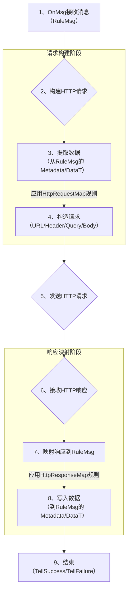

# RFC: HTTP Client 节点功能与重构 (EnhanceHttpClientNode)

## 1. 摘要 (Summary)

本RFC提议对`external/httpClient`节点进行一次彻底的重构，旨在引入与`endpoint/http`节点对齐的高级输入/输出映射机制，并增强其对多种`Content-Type`的原生支持，使其成为一个功能更强大、配置更灵活的外部HTTP服务集成工具。

## 2. 动机 (Motivation)

*   **当前存在的问题**:
    1.  **数据类型处理能力弱**: 当前实现强依赖于将`RuleMsg.Data`作为JSON进行处理，无法原生支持向外部API发送纯文本(`text/plain`)、二进制流(`application/octet-stream`)等非JSON格式的数据。
    2.  **核心字段未被利用**: `RuleMsg.Type()` 字段在框架中已有定义但未被有效利用，而 `RuleMsg.Data()` 字段在经过节点处理后，其作为“原始载体”的语义丢失。
    3.  **输入/输出映射过于简单**: 当前的`RequestMap`和`ResponseMap`配置只能进行粗粒度的、基于整个`msg.Data()`或`msg.DataT()`对象的映射，无法实现字段级别的精细化控制。

*   **用例**:
    -   **用例一 (复杂请求构建)**: 开发者希望从`RuleMsg`的`Metadata`中提取认证Token，从`DataT`的`userObj`中提取用户信息，共同构建一个发往外部系统的HTTP请求。当前节点无法实现。
    -   **用例二 (非JSON数据)**: 开发者需要将`RuleMsg.Data`中的一段纯文本日志，以`Content-Type: text/plain`的形式POST到一个日志聚合服务。当前节点无法直接支持。
    -   **用例三 (精确响应映射)**: 开发者希望将HTTP响应体中的`transactionId`字段存入`RuleMsg.Metadata`，并将`orderStatus`字段更新到`DataT`中的`orderObj.status`字段。当前节点无法实现这种精确映射。

*   **目标**:
    1.  **盘活核心字段**: 正式启用 `RuleMsg.Type()` 字段，用其明确`RuleMsg.Data()`的内容类型，并确保`Data`字段在`httpClient`响应后承载完整的原始响应体。
    2.  **功能对齐**: 使`httpClient`节点的配置能力和数据处理能力与`httpEndpoint`节点看齐。
    3.  **提升灵活性**: 实现`RuleMsg`与HTTP报文之间的双向、字段级映射。
    4.  **体验一致性**: 统一`Matrix`框架内外部HTTP交互的配置体验，降低开发者的学习成本。

## 3. 设计详解 (Detailed Design)

### 核心思路 (CoreIdea)
本次重构的核心是**抽象和复用**。我们将：
1.  **引入`DataType`**: 为`RuleMsg`接口添加`DataType`字段，专门用于描述`Data`字段的内容格式，使其与`Type`字段（消息身份标识）解耦。
2.  **提取公共HTTP映射逻辑**: 在核心辅助包 `matrix/pkg/helper` 中新增文件（如`http_mapper.go`），将`http_client_node`和`http_endpoint`中相似的“`RuleMsg`与HTTP报文互相转换”的逻辑提取出来，形成可复用的`Mapper`函数。
3.  **重构节点**: 重构`http_client_node`和`http_endpoint`，使其调用公共的`Mapper`来完成核心工作，自身只保留少量特定逻辑。

### 响应处理的核心流程 (ResponseHandlingFlow)
无论用户如何配置响应映射，`httpClient`节点在收到HTTP响应后，都将执行以下两个固定的核心操作：
1.  **设置原始响应体**: 将完整的、未经修改的HTTP响应体存入 `msg.SetData()`。
2.  **设置数据类型**: 根据HTTP响应头的`Content-Type`，为出站消息设置`msg.SetDataType()`。例如，`application/json` -> `"JSON"`, `text/plain` -> `"TEXT"`。

在此基础上，用户可以通过`HttpResponseMap`将响应体中的特定字段进一步映射到`Metadata`或`DataT`中。

### API变更 (核心接口)

**1. `matrix/pkg/types/types.go`**
```go
// RuleMsg is the interface for a message in the rule engine.
type RuleMsg interface {
    // ... (existing methods)

    // DataFormat returns the format of the Data field, e.g., "JSON", "TEXT".
    DataFormat() string
    // WithDataFormat sets the format of the Data field and returns the message for chaining.
    WithDataFormat(dataFormat string) RuleMsg

    // ... (existing methods)
}
```
*   **新增**: `DataFormat() string` 和 `WithDataFormat(string) RuleMsg`。`WithDataFormat` 返回 `RuleMsg` 以支持链式调用 `msg := types.NewMsg(...).WithDataFormat("JSON")`。
*   **不变**: `NewMsg` 函数签名将保持不变，以最大程度地减少对现有代码的破坏性影响。

**2. `matrix/pkg/types/msg.go`**
*   `DefaultRuleMsg` 结构体将添加 `dataFormat string` 字段。
*   `DefaultRuleMsg` 将实现 `DataFormat()` 和 `WithDataFormat()` 方法。

### API变更 (公共映射工具)

将在 `matrix/pkg/helper/http_mapper.go` 中定义新的公共结构和函数。

```go
package helper

// HttpParam and HttpMapping will be defined here, shared by both nodes.
type HttpParam struct { ... }
type HttpMapping struct { ... }

// Definitions for request and response mapping rules.
type HttpRequestMap struct { ... }
type HttpResponseMap struct { ... }

// Reusable mapping functions
func MapRuleMsgToHttpRequest(ctx types.NodeCtx, msg types.RuleMsg, cfg HttpRequestMap) (*http.Request, error) { ... }
func MapHttpResponseToRuleMsg(ctx types.NodeCtx, resp *http.Response, msg types.RuleMsg, cfg HttpResponseMap) error { ... }

// Similar functions will be created for http_endpoint's logic
func MapHttpRequestToRuleMsg(...) error { ... }
func MapRuleMsgToHttpResponse(...) (body, headers, statusCode, err) { ... }
```

**变更前的数据结构:**
```go
// old
type RequestMap struct {
	URL           string            `json:"url"`
	Method        string            `json:"method"`
	Headers       map[string]string `json:"headers"`
	Body          BodyMap           `json:"body"`
    // ...
}
type BodyMap struct {
	Source string `json:"source"`
	Path string `json:"path,omitempty"`
	StaticContent any `json:"staticContent,omitempty"`
}
type ResponseMap struct {
	StatusCodeTarget string `json:"statusCodeTarget,omitempty"`
	BodyTarget string `json:"bodyTarget,omitempty"`
}
```

**变更后的数据结构:**
```go
// new
type HttpClientNodeConfiguration struct {
	DefaultTimeout string `json:"defaultTimeout"`
	ProxyURL       string `json:"proxyUrl"`
	Request        HttpRequestMap  `json:"request"`
	Response       HttpResponseMap `json:"response"`
}

type HttpParam struct {
	Name     string         `json:"name"`
	Type     types.DataType `json:"type"`
	Required bool           `json:"required"`
	Mapping  HttpMapping    `json:"mapping"`
}

type HttpMapping struct {
	From      string `json:"from"` // e.g., "metadata.token", "dataT.userObj.id"
	To        string `json:"to"`   // e.g., "header.X-Auth-Token", "body.userId"
	DefineSID string `json:"defineSid,omitempty"`
}

type HttpRequestMap struct {
	URL           string      `json:"url"`
	Method        string      `json:"method"`
	Headers       []HttpParam `json:"headers"`
	QueryParams   []HttpParam `json:"queryParams"`
	Body          BodyMap     `json:"body"`
    // ...
}

type BodyMap struct {
	// "fields": 通过bodyFields映射构建JSON请求体，Content-Type固定为application/json。
	// "data": 直接使用msg.Data作为请求体，Content-Type由msg.Type()推断。
	Source     string      `json:"source"`
	BodyFields []HttpParam `json:"bodyFields,omitempty"` // 当 source 为 "fields" 时使用
}

type HttpResponseMap struct {
	StatusCodeTarget string      `json:"statusCodeTarget,omitempty"`
	Headers          []HttpParam `json:"headers,omitempty"`
	BodyFields       []HttpParam `json:"bodyFields,omitempty"`
}
```

### 请求体构建规则 (RequestBodyRules)

节点将根据`BodyMap.Source`的值，遵循不同的逻辑来构建请求体：

1.  **当 `source` 为 `"fields"` 时 (映射模式):**
    -   节点将忽略 `msg.Data()` 和 `msg.DataFormat()`。
    -   从 `msg.Metadata()` 和 `msg.DataT()` 中提取数据，根据 `bodyFields` 规则构建一个`map[string]interface{}`。
    -   将该map序列化为JSON字符串作为请求体。
    -   HTTP请求的`Content-Type`头部将**固定**设置为`application/json`。

2.  **当 `source` 为 `"data"` 时 (直接模式):**
    -   节点将忽略 `bodyFields` 配置。
    -   直接使用 `msg.Data()` 的内容作为请求体。
    -   HTTP请求的`Content-Type`头部将根据 `msg.DataFormat()` 的值进行推断：
        -   `"JSON"` -> `application/json`
        -   `"TEXT"` -> `text/plain`
        -   `"BYTES"` -> `application/octet-stream` (此时`msg.Data`应为Base64编码)
        -   其他或为空 -> `text/plain`

### 映射源路径(`from`)说明 (MappingSourcePath)
为了支持从JSON格式的`msg.Data`中提取数据，`HttpMapping.From`路径将支持以下前缀：
- `metadata.your_key`
- `dataT.your_obj_id.your_field`
- `data.your_json_field.sub_field` (仅当`msg.DataFormat()`为`"JSON"`时有效)

### 组件交互 (ComponentInteraction)



### 示例 (Examples)

**示例1: 构造复杂JSON请求**
```json
"request": {
    "url": "https://api.example.com/v2/user_orders",
    "method": "POST",
    "headers": [
        {
            "name": "X-Auth-Token",
            "mapping": { "from": "metadata.token" }
        }
    ],
    "body": {
        "contentType": "application/json",
        "bodyFields": [
            {
                "name": "username",
                "mapping": { "from": "dataT.userObj.name" }
            },
            {
                "name": "orderId",
                "mapping": { "from": "dataT.orderObj.id" }
            }
        ]
    }
}
```

**示例2: 映射响应到DataT（动态创建）**
```json
"response": {
    "statusCodeTarget": "metadata.http_status",
    "bodyFields": [
        {
            "name": "id",
            "mapping": {
                "to": "dataT.newOrder.orderId",
                "defineSid": "OrderSID"
            }
        },
        {
            "name": "amount",
            "mapping": {
                "to": "dataT.newOrder.total"
            }
        }
    ]
}
```

## 4. 全面影响分析 (Comprehensive Impact Analysis)

此方案对现有代码的侵入性较低。`NewMsg`函数签名保持不变，因此不需要修改所有调用点。

*   **`endpoint/http` 节点**:
    *   **重构**: `http_endpoint.go` 将被重构，以调用新的公共映射函数。
    *   **适配**: 在其 `NewMsg` 调用之后，需要增加一行代码：`msg = msg.WithDataFormat("JSON")`，以正确设置其生产的消息的数据格式。

*   **其他消息生产者**:
    *   **按需适配**: 对于其他明确知道自己生产的消息`Data`格式的节点（如`redis_stream_endpoint`, `inotify_endpoint_node`），也应在`NewMsg`后增加对`WithDataFormat`的调用。
    *   **向后兼容**: 对于未修改的旧代码，`msg.DataFormat()`将返回空字符串，`httpClient`节点会将其作为默认类型（如`text/plain`）处理，保证了基础的向后兼容性。

*   **代码复用带来的收益**:
    *   **减少重复**: `http_client_node` 和 `http_endpoint` 之间超过50%的映射逻辑代码将被移除并替换为对公共`helper`包的调用。
    *   **行为一致**: 确保了两个核心HTTP组件在处理数据映射时的行为和逻辑完全一致，降低了未来维护的复杂性。

## 5. 缺点与风险 (Drawbacks & Risks)

*   **破坏性变更**: 这是对`httpClient`节点配置的完全重写，所有使用了该节点的现有规则链都必须进行修改才能工作。
*   **迁移成本**: 需要投入开发资源编写一个可靠的Codemod迁移脚本，并验证其在所有场景下的正确性。

## 6. 备选方案 (Alternatives)

*   **创建新节点 `httpClientV2`**:
    *   **优点**: 可以保持向后兼容，不影响现有规则链。
    *   **缺点**: 导致节点类型膨胀，增加了框架的复杂性和用户的选择困惑。从长远来看，维护两个功能高度重叠的节点会带来更高的成本。
*   **结论**: 考虑到`httpClient`是核心基础节点，其功能应该是内聚和演进的。因此，选择直接重构并提供强大的迁移工具是更优的长期策略。

## 7. 未解决的问题 (UnresolvedQuestions)

*   对于超大文件的流式处理（streaming），本次重构暂不作为一期目标，但新的设计应为其未来的实现保留扩展性。(StreamingForLargeFiles)

## 8. 常见问题与解答 (FAQ)

<!-- qa_section_start -->
> **问：这个变更会影响现有的规则链吗？是否需要数据迁移？**
> **答：** 是的，这是一个破坏性变更。所有使用了旧版`httpClient`节点的规则链都需要进行修改。为了平滑过渡，我们将在`阶段三：验证`中，编写一个自动化的迁移脚本（Codemod）来帮助用户升级他们的JSON规则链定义，并提供一份详细的迁移指南。

> **问：这个功能的性能如何？是否会比旧版更慢？**
> **答：** 由于引入了更复杂的字段级映射和反射操作，单次执行的开销理论上会略高于旧版。但这种开销在一次网络IO的耗时面前几乎可以忽略不计。新设计带来的灵活性和开发效率的提升，远超其微小的性能开销。
<!-- qa_section_end -->
