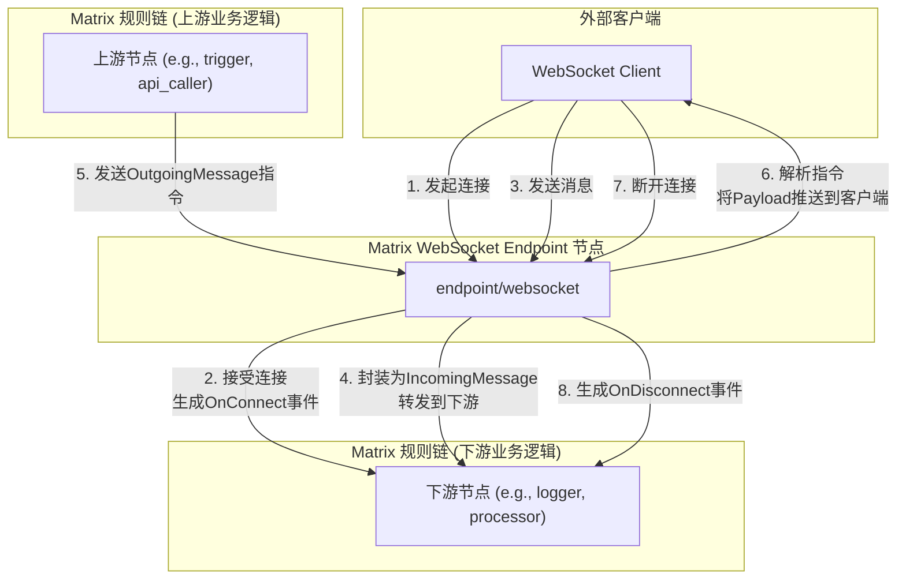

# RFC: 实现Matrix WebSocket Endpoint节点 (ImplementMatrixWebSocketEndpoint)

## 1. 动机 (Motivation)

`Matrix` 框架目前缺少一种标准化的、事件驱动的方式来与外部客户端（如Web前端、桌面应用）进行实时双向通信。当前的HTTP Endpoint节点只支持请求-响应模式，无法满足需要服务器主动推送消息的场景（如实时监控、消息通知、协作应用等）。

引入WebSocket Endpoint将极大增强 `Matrix` 的实时交互能力，使其能够支持更广泛的应用场景，并为平台提供一个标准化的、可复用的实时通信解决方案。

## 2. 核心提案 (Proposal)

### 2.1. 概述 (Summary)

本提案建议创建一个新的 `Matrix` 通用组件节点，类型为 `endpoint/websocket`。该节点将作为一个功能完备的WebSocket服务器，负责管理客户端连接的完整生命周期，并处理与规则链之间的双向消息流。它将作为 `Matrix` 平台实时通信能力的基石。

### 2.2. 设计与实现要点 (KeyDesignAndImplementationPoints)

<!--
finetune_role: "user"
finetune_instruction: "请绘制一个Mermaid流程图，展示WebSocket Endpoint节点如何处理客户端连接、接收消息并与Matrix规则链进行交互。"
-->

*   **要点一: WebSocket Endpoint节点 (`endpoint/websocket`)**
    *   创建一个新的 `Matrix` 通用组件节点，类型为 `endpoint/websocket`。
    *   该节点应能作为一个HTTP服务器，监听指定端口和路径，并将传入的HTTP请求升级为WebSocket连接。
    *   节点应能管理所有活跃的客户端连接，并为每个连接分配一个唯一的 `ClientID`。

*   **要点二: 可配置的事件到`CoreObj`映射**
    *   节点将提供一个 `eventMappings` 配置项，允许用户为 `OnConnect`（连接建立）、`OnDisconnect`（连接断开）和 `OnMessage`（收到消息）这三种事件，分别定义如何生成一个 `CoreObj`。
    *   **映射规则**: 每个事件的映射规则将包含：
        1.  `targetCoreObjSID`: 指定要创建的目标 `CoreObj` 的SID。
        2.  `fieldMappings`: 一个字段映射列表，定义如何将事件的内置数据源（如 `clientId`, `remoteAddr`, `payload`）填充到目标 `CoreObj` 的指定字段中。
    *   这种设计与现有的 `HTTPEndpoint` 节点保持一致，提供了最大的灵活性，避免了硬编码任何特定的 `CoreObj`。

*   **要点三: 双向消息通信**
    *   **客户端 -> 规则链**: 当收到客户端消息时，节点将遵循 `eventMappings.onMessage` 规则，将客户端发送的JSON数据动态地解析并映射到一个用户指定的 `CoreObj` 中，然后发送到下游。
    *   **规则链 -> 客户端**: 节点必须能够作为一个 **共享资源** 被其他节点通过 `ref://` 引用。它应能处理一个 `WebSocketOutgoingMessage` 核心对象，该对象指定了 `TargetClientID` 和要发送的 `Payload` (另一个 `CoreObj`)。节点收到后，会将 `Payload` 序列化为JSON并发送给目标客户端。

## 3. 备选方案 (Alternatives)

*   **方案A: 使用HTTP长轮询/SSE**
    *   **未选择原因**: 相比WebSocket，长轮询和SSE（Server-Sent Events）在实现双向通信方面效率较低或功能受限。长轮询会产生大量无用的HTTP请求开销；SSE是单向的（服务器到客户端），无法满足客户端向服务器发送消息的需求。WebSocket是实现真正全双工实时通信的行业标准。

## 4. 影响评估 (ImpactAssessment)

*   **正面影响**: 极大增强 `Matrix` 框架的实时交互能力，解锁新的应用场景。为平台提供一个标准化的、可复用的实时通信解决方案。
*   **负面影响**: 引入了有状态的网络连接管理，相比无状态的HTTP请求，会增加服务器的内存消耗和管理的复杂性。需要妥善处理连接的生命周期和资源回收。

<!-- qa_section_start -->
> **问：这个节点如何处理认证和授权？**
> **答：** 初版RFC中，认证授权的逻辑将委托给下游节点处理。`OnConnect`事件可以触发一个授权流程，如果授权失败，下游节点可以向WebSocket Endpoint节点发送一个“断开连接”的指令。未来的版本可以考虑在节点配置中直接集成认证策略。

> **问：如何保证消息的顺序和可靠性？**
> **答：** WebSocket协议本身（基于TCP）保证了单个连接内的消息顺序。至于跨节点的可靠性，本RFC暂不涉及。如果需要严格的“至少一次”或“恰好一次”保证，应由下游的业务逻辑结合持久化存储（如Kafka、数据库）来实现，WebSocket节点本身只负责尽力而为的实时消息传输。
<!-- qa_section_end -->
