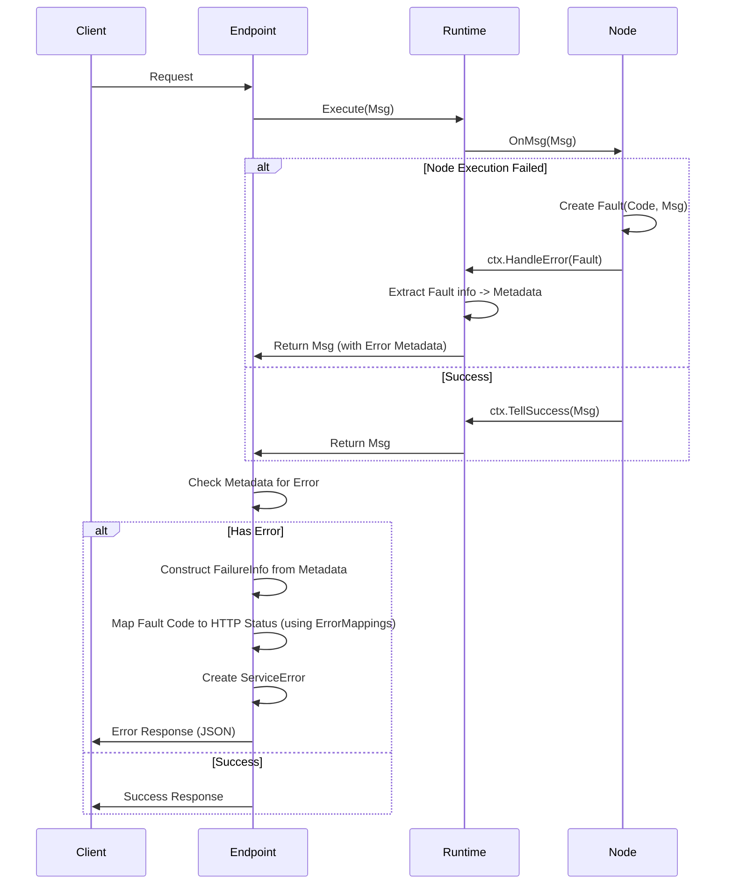

# RFC: Unified Error Handling (Title)

## 1. 摘要 (Summary)

本RFC提议在Matrix框架中建立统一的错误处理模型，引入三层错误结构：静态定义的`Fault`、运行时上下文的`FailureInfo`（原ChainError）以及面向外部用户的`ServiceError`（原ErrorObj）。该模型旨在标准化节点错误定义、增强运行时错误追踪能力，并提供灵活的错误码映射机制，以便更好地集成到HTTP/gRPC等协议中。

## 2. 动机 (Motivation)

### 当前存在的问题
*   **错误定义分散**: 各个组件随意返回Go标准`error`，缺乏统一的错误码（ErrorCode）和错误信息规范，导致上层难以区分错误类型。
*   **上下文丢失**: 原始错误在层层传递中往往丢失了发生错误的节点ID、时间戳等关键运行时信息，不利于排查问题。
*   **协议耦合**: 内部错误直接暴露给外部接口（如HTTP 500），缺乏灵活的映射机制将业务错误转换为合适的协议状态码（如400 vs 500）。
*   **概念混淆**: `ErrorObj`（面向用户）和`ChainError`（面向执行链）职责不清，导致使用上的混乱。

### 目标
*   **标准化错误定义**: 通过`Fault`结构体定义静态错误（Code + Message），并在组件开发阶段强制使用。
*   **丰富的运行时上下文**: 通过`FailureInfo`结构体捕获错误发生的节点上下文（NodeID, Timestamp等），并将其放入消息Metadata中传递。
*   **灵活的错误映射**: 在Endpoint层引入`ServiceError`和`ErrorMapping`配置，支持将内部`Fault`映射为特定的HTTP状态码或自定义错误码。
*   **统一处理流程**: 规范Node -> Context -> Endpoint的错误处理链路。

## 3. 设计详解 (DetailedDesign)

### 核心思路

错误模型分为三层：

1.  **Fault (静态故障)**:
    *   **定义**: 开发阶段定义的错误模板，包含固定的`Code`（int32）和`Message`（string）。
    *   **用途**: 用于组件内部标识特定的错误场景（如`FaultExprCompilationFailed`）。
    *   **能力**: 支持`Wrap(error)`来携带具体的底层错误堆栈。

2.  **FailureInfo (运行时故障信息)**:
    *   **定义**: 运行时捕获的错误详情，包含`Fault`的Code/Message，以及NodeID、NodeName、Timestamp等上下文信息。
    *   **用途**: 存储在消息Metadata中，随消息流转，供后续节点或Endpoint消费。

3.  **ServiceError (服务错误)**:
    *   **定义**: 面向外部客户端的错误对象，包含`ResponseCode`（协议状态码）、`UserMessage`（用户友好的信息）和`FailureInfo`。
    *   **用途**: Endpoint在处理完规则链后，根据`FailureInfo`和配置的映射规则生成，最终序列化返回给调用方。

### API变更

#### 1. 新增错误类型定义 (`pkg/types/error.go`)

```go
// Fault: 静态定义的错误
type Fault struct {
    Code    int32
    Message string
    Wrapped error
}

// FailureInfo: 运行时错误上下文
type FailureInfo struct {
    Error     string `json:"error"`
    NodeID    string `json:"error_node_id"`
    NodeName  string `json:"error_node_name"`
    Timestamp string `json:"error_timestamp"`
    Code      string `json:"error_code"`
}

// ServiceError: 对外服务错误
type ServiceError struct {
    ResponseCode int32
    UserMessage  string
    Cause        error
    FailureInfo  *FailureInfo
}
```

#### 2. NodeCtx 增强 (`internal/runtime/node_context.go`)

`HandleError` 方法被增强，负责将 `error`（通常是 `Fault`）转换为 Metadata 中的标准键值对。

```go
func (ctx *DefaultNodeCtx) HandleError(msg types.RuleMsg, err error) {
    // ... 记录日志 ...
    
    // 填充Metadata
    metadata := msg.Metadata()
    metadata[types.MetaError] = err.Error()
    metadata[types.MetaErrorNodeID] = ctx.SelfDef().ID
    metadata[types.MetaErrorTimestamp] = time.Now().UTC().Format(time.RFC3339)

    var fault *types.Fault
    if errors.As(err, &fault) {
        metadata[types.MetaErrorCode] = fmt.Sprintf("%d", fault.Code)
    }

    // ... 路由到 Failure 路径 ...
}
```

#### 3. Endpoint 配置增强 (`pkg/types/endpoint.go`)

Endpoint 配置增加 `errorMappings` 字段，支持将内部错误码映射为协议状态码。

```go
type HttpEndpointNodeConfiguration struct {
    // ... 其他配置 ...
    ErrorMappings map[string][]string `json:"errorMappings"` // "500": ["20001", "20002"]
}
```

### 组件交互流程



### 示例

**节点代码示例**:
```go
if err != nil {
    // 使用预定义的Fault包装底层错误
    ctx.HandleError(msg, FaultExprEvaluationFailed.Wrap(err))
    return
}
```

**Endpoint配置示例**:
```json
{
  "errorMappings": {
    "400": ["202501003"], // 将 "No Match Case" 错误映射为 400 Bad Request
    "500": ["202501001", "202501002"] // 将编译/执行失败映射为 500
  }
}
```

## 4. 缺点与风险 (DrawbacksAndRisks)

*   **迁移成本**: 现有的自定义节点如果直接使用了 `fmt.Errorf` 而没有使用 `Fault`，虽然兼容（会被视为无Code的错误），但会丢失错误码特性，需要逐步重构。
*   **配置复杂度**: `ErrorMappings` 提供了灵活性，但也增加了配置的复杂度，通过UI配置可以缓解此问题。
*   **Metadata依赖**: 错误信息依赖 Metadata 传递，如果 Metadata 在链中被意外清除，会导致 Endpoint 无法正确重建错误上下文。

## 5. 备选方案 (Alternatives)

*   **直接返回 error**: 这种方式简单，但无法跨进程/跨服务边界传递丰富的结构化错误信息（特别是当 Matrix 分布式部署时）。
*   **全链路使用 ServiceError**: 让节点直接返回 `ServiceError`。这会导致节点与具体的协议（HTTP/RPC）耦合过重，违背了 Matrix 节点协议无关的设计原则。

## 6. 未解决的问题 (UnresolvedQuestions)

*   目前的 `Fault.Code` 使用 `int32`，未来是否需要支持字符串类型的错误码（如 "ERR_INVALID_PARAM"）以提高可读性？
*   `FailureInfo` 的结构是否需要进一步扩展以支持多语言错误信息？

## 7. 常见问题与解答 (FAQ)

<!-- qa_section_start -->
> **问：旧的节点代码需要修改吗？**
> **答：** 不需要强制修改。`HandleError` 兼容普通的 `error` 接口。但建议新开发的节点都使用 `Fault` 以获得更好的错误分类能力。

> **问：如果我不配置 errorMappings 会怎样？**
> **答：** Endpoint 会使用默认的错误码（通常是 500）来响应所有错误。
<!-- qa_section_end -->