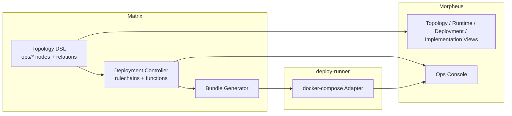
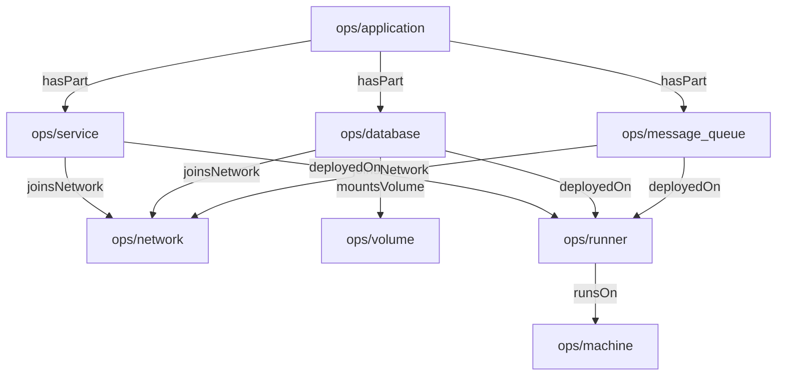
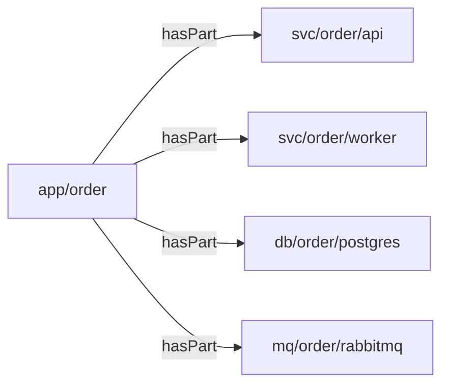
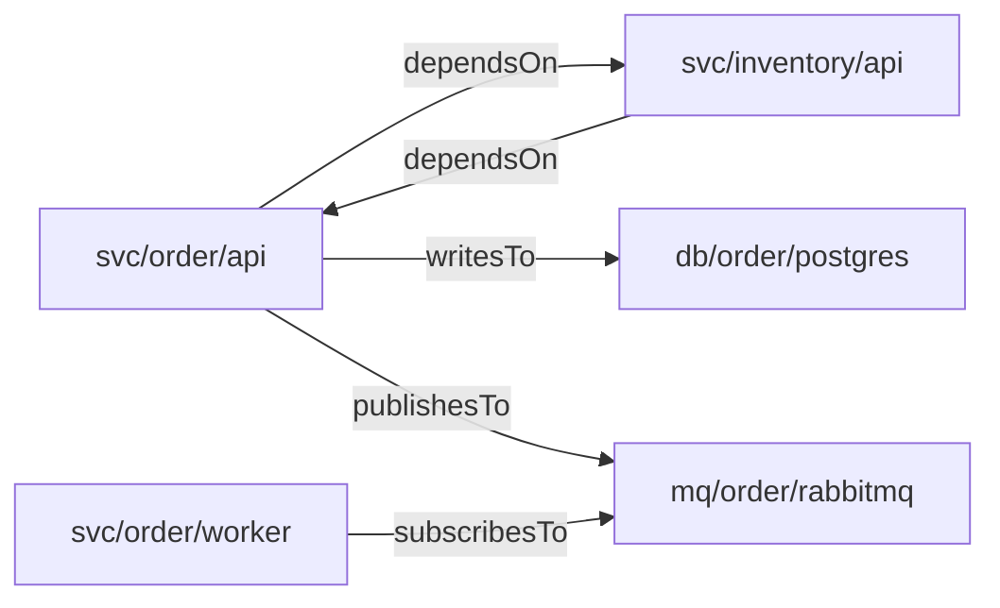
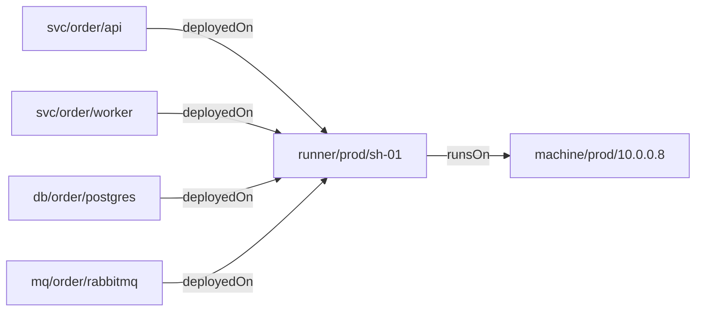
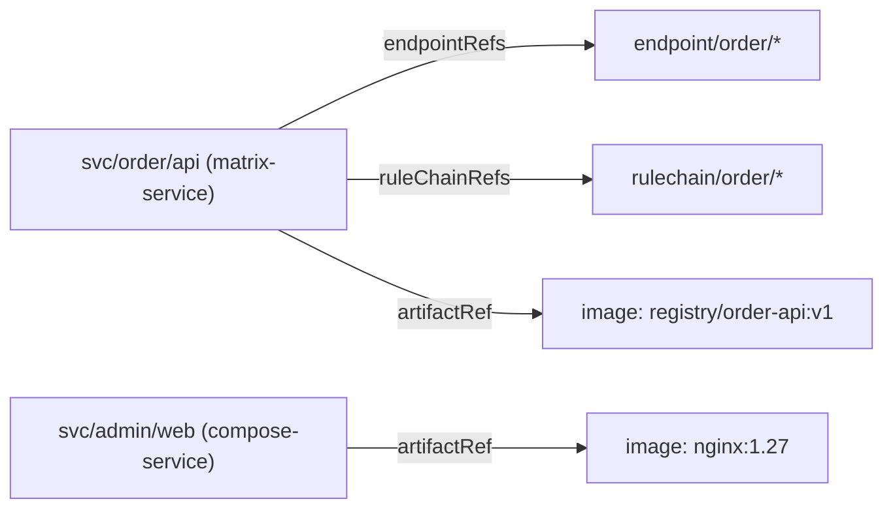
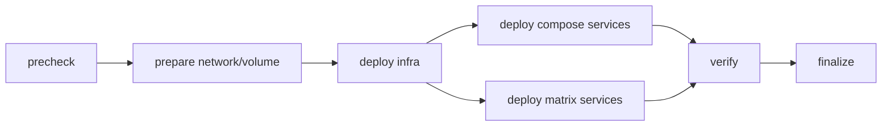

# RFC: 拓扑驱动的多视图部署与自动分发平台 (TopologyDrivenDeploymentPlatform)

## 1. 摘要 (Summary)

本RFC提议建设一套以 `Matrix` 拓扑 DSL 为单一事实来源、以 `Morpheus` 为可视化与操作入口、以独立 `deploy-runner` 为执行面的自动化部署平台。

该平台的核心目标是：

1. 用统一的 `ops/*` 节点描述应用、服务、数据库、消息队列、网络、卷、Runner、宿主机等部署实体。
2. 允许同一份拓扑在不同视角下被渲染为逻辑拓扑图、运行依赖图、部署目标图、实现关联图和部署计划图。
3. 支持 `Matrix` 服务与完全非 `Matrix` 组件的统一建模、统一分发和统一观测。
4. 由 `controller` 基于拓扑与部署策略自动生成可执行的部署 DAG，并分发到 `docker-compose` 型 `deploy-runner` 执行。

## 2. 背景与问题 (Context)

当前 `Matrix` 已具备 DSL、规则链、函数节点和多视图图渲染的基础能力，也已有针对运维基础组件与 DSL 扩展的设计方向。但仍缺少一套完整的、可落地的部署平台方案，主要缺口如下：

1. 缺少统一的部署拓扑模型，无法稳定表达应用与其运行组件、依赖组件、部署目标之间的关系。
2. 现有规则链图更偏执行流与数据流，尚未形成面向部署场景的稳定视图语义。
3. `Matrix` 服务可以被规则链描述，但数据库、消息队列、普通 Compose 服务等非 `Matrix` 组件缺少统一的建模方式。
4. 现有系统缺少“从拓扑模型自动生成部署配置，并分发给执行器”的闭环能力。

## 3. 目标与非目标 (Goals / Non-Goals)

### 3.1. 目标

1. 在 `Matrix` 中引入完整的部署拓扑源模型。
2. 支持拓扑图存在环，且按不同视角进行投影展示。
3. 支持 `Matrix` 服务和完全非 `Matrix` 组件的统一部署。
4. 支持以 `docker-compose` 为首个 Runner 适配器。
5. 支持将 `rulechain`、`endpoint` 与 `ops/service` 关联，并自动生成对应部署工件。

### 3.2. 非目标

1. 本期不实现 Kubernetes、Nomad、Terraform 等多执行器适配。
2. 本期不实现跨多集群调度，只支持 Controller 按 Runner 维度拆分部署。
3. 本期不要求 `deploy-runner` 理解 `Matrix` DSL 语义；Runner 只消费 Controller 生成的 typed bundle。

## 4. 放置决策 (Placement Decision)

本方案不是单独放入 `Matrix`、`Morpheus` 或“新平台”中的某一个，而是采用分层归属：

### 4.1. Matrix 负责

1. `ops/*` 节点定义与核心对象。
2. 拓扑 DSL 的单一事实来源。
3. 多视角投影所需的语义元数据。
4. `controller` 规则链、函数节点、部署 DAG 生成与 bundle 生成。

### 4.2. Morpheus 负责

1. 拓扑视图、运行依赖视图、部署目标视图、实现关联视图、部署计划视图。
2. 部署操作入口、执行状态回放、Runner 状态可视化。
3. 节点详情、关联的 `rulechain` / `endpoint` / `runner` / `machine` 信息展示。

### 4.3. 新平台仅新增执行面

本期不引入新的独立控制平面，只新增一个执行面组件：

*   **`deploy-runner`**: 负责接收 Controller 下发的部署 bundle，并调用 `docker compose` 执行部署、回滚、健康检查与日志回传。

结论是：**方案文档应归档在 `Matrix/docs/designs/rfc/`，因为它的源模型与控制语义属于 Matrix；Morpheus 与 Runner 是该 RFC 的集成落点。**

## 5. 总体架构 (Architecture)



## 6. 源拓扑模型 (Source Topology Model)

### 6.1. 核心原则

1. 源拓扑只维护一份。
2. 源拓扑允许有环。
3. 源拓扑默认是不可执行 DSL：`ruleChain.attrs.executable=false`。
4. 执行流不直接写在源拓扑里，而由 Controller 从拓扑与策略推导。

### 6.2. 节点类型

| 节点类型 | 角色 | 是否可部署 | 说明 |
| :--- | :--- | :--- | :--- |
| `ops/application` | 逻辑聚合根 | 否 | 表示一个业务系统或产品边界 |
| `ops/service` | 核心服务单元 | 是 | 可表示 `Matrix` 服务或非 `Matrix` 服务 |
| `ops/database` | 数据存储组件 | 是 | 可表示 Compose 数据库或外部托管数据库 |
| `ops/message_queue` | 消息中间件组件 | 是 | 可表示 Compose MQ 或外部托管 MQ |
| `ops/network` | 网络资源 | 否 | 作为部署资源依赖，默认在主视图折叠 |
| `ops/volume` | 存储卷资源 | 否 | 作为部署资源依赖，默认在主视图折叠 |
| `ops/runner` | 部署执行器 | 否 | 表示一个 Runner 实例或 Runner 入口 |
| `ops/machine` | 宿主机 | 否 | 表示 Runner 所在主机 |

### 6.3. 节点组织

推荐组织层级如下：



### 6.4. 统一部署字段

所有可部署节点（`ops/service`、`ops/database`、`ops/message_queue`）都应支持统一的部署字段：

```json
{
  "runtimeProfile": "matrix-service | compose-service | compose-database | compose-mq | external-managed",
  "deployAdapter": "docker-compose | none",
  "deployable": true,
  "runnerRef": "runner/prod/sh-01",
  "artifactRef": "registry.example.com/order-api:v1.2.3",
  "networkRefs": ["net/prod/backend"],
  "volumeRefs": ["vol/prod/order-db"],
  "envRefs": ["secret://env/order-api"],
  "secretRefs": ["secret://file/order-api"],
  "healthCheck": {
    "type": "http",
    "target": "http://order-api:8080/healthz"
  }
}
```

其中只有 `Matrix` 服务额外支持：

```json
{
  "ruleChainRefs": ["order/rc-http", "order/rc-async-worker"],
  "endpointRefs": ["ep-order-create", "ep-order-query"]
}
```

## 7. 关系语义 (Relation Semantics)

推荐关系标签收敛为以下集合：

| label | 含义 |
| :--- | :--- |
| `hasPart` | `application` 包含组件 |
| `dependsOn` | 服务对服务的运行依赖 |
| `readsFrom` | 服务从数据库读取 |
| `writesTo` | 服务向数据库写入 |
| `publishesTo` | 服务向消息队列发布 |
| `subscribesTo` | 服务从消息队列订阅 |
| `joinsNetwork` | 节点加入网络 |
| `mountsVolume` | 节点挂载卷 |
| `deployedOn` | 节点部署到 Runner |
| `runsOn` | Runner 运行在宿主机上 |

对于 `rulechain` 与 `endpoint`，不建议在默认主拓扑图中直接作为一等节点铺开，而是优先挂到 `ops/service` 配置中，在“实现关联视图”中按需展开。

## 8. 多视图投影 (Multi-View Projection)

同一份源拓扑可以投影成多个视图。视图切换是前端和后端图构建逻辑的职责，不要求维护多份拓扑 DSL。

### 8.1. 视图一：Topology

用途：回答“系统长什么样”。

规则：

1. 只显示 `application / service / database / message_queue`。
2. 默认隐藏 `network / volume / runner / machine`，仅以摘要形式出现在详情面板。
3. 只消费 `relations`。
4. 允许有环。



### 8.2. 视图二：Runtime Dependency

用途：回答“运行时谁依赖谁”。

规则：

1. 主要显示 `service` 与其服务依赖、数据库、消息队列。
2. 展示 `dependsOn / readsFrom / writesTo / publishesTo / subscribesTo`。
3. 明确允许有环。



### 8.3. 视图三：Deployment Target

用途：回答“组件会部署到哪里”。

规则：

1. 显示 `service / database / message_queue / runner / machine`。
2. 展示 `deployedOn` 与 `runsOn`。
3. 默认不展示 `application`。



### 8.4. 视图四：Implementation

用途：回答“服务由什么实现”。

规则：

1. 对 `Matrix` 服务可展开显示其 `ruleChainRefs` 与 `endpointRefs`。
2. 对完全非 `Matrix` 组件，仅显示其工件、镜像与部署方式。
3. 该视图属于 `hybrid` 视图，不要求只使用 `relations`。



### 8.5. 视图五：Deployment Plan

用途：回答“这次部署会如何执行”。

规则：

1. 该视图不是源拓扑的直接展示，而是 Controller 根据拓扑投影生成的执行图。
2. 必须是 DAG。
3. 支持将原始拓扑中的环压缩为同一部署波次。



## 9. 支持完全非 Matrix 组件部署 (Non-Matrix Components)

部署阶段必须支持完全与 `Matrix` 无关的组件，这也是本方案的硬性要求。

### 9.1. 支持方式

通过 `runtimeProfile` 区分组件类型：

| runtimeProfile | 含义 | 是否携带 Matrix DSL |
| :--- | :--- | :--- |
| `matrix-service` | 需要 Matrix 运行时的服务 | 是 |
| `compose-service` | 普通 Compose 服务 | 否 |
| `compose-database` | 通过 Compose 部署的数据库 | 否 |
| `compose-mq` | 通过 Compose 部署的消息队列 | 否 |
| `external-managed` | 外部托管组件 | 否 |

### 9.2. Controller 处理规则

1. `matrix-service`
   - 生成 Compose 服务定义。
   - 附带 `Matrix` 配置、`rulechain`、`endpoint`、`prompt`、`shared` 等工件。
2. `compose-service`
   - 只生成镜像、环境变量、网络、卷、健康检查等 Compose 配置。
3. `compose-database` / `compose-mq`
   - 生成状态型组件所需的 Compose 片段。
4. `external-managed`
   - 不生成部署任务，只参与连通性校验、依赖校验和运行态展示。

结论：**Runner 不依赖 Matrix 才能执行大多数部署任务，只有 bundle 中包含 `matrix-service` 时才需要把附带 DSL 下发到目标容器。**

## 10. Controller 设计 (Deployment Controller)

### 10.1. 输入

1. 源拓扑 DSL。
2. 目标应用、环境、Runner 选择范围。
3. 发布制品版本。
4. 部署策略（是否包含基础设施、是否允许并发、回滚策略等）。

### 10.2. 核心步骤

1. `load_topology`
2. `validate_topology`
3. `select_scope`
4. `project_runtime_dependencies`
5. `collapse_cycles_to_groups`
6. `assign_deploy_phases`
7. `partition_by_runner`
8. `generate_runner_bundles`
9. `dispatch_bundles`
10. `collect_status_and_reconcile`

### 10.3. 如何处理拓扑中的环

源拓扑允许有环，但部署执行图必须收敛成 DAG。推荐算法如下：

1. 先从 `relations` 中提取与部署相关的依赖边。
2. 对部署依赖图做强连通分量（SCC）压缩。
3. 将每个 SCC 视为一个部署波次组（wave group）。
4. 再叠加相位屏障：
   - `prepare`
   - `infra`
   - `stateful`
   - `stateless`
   - `verify`
5. 最终得到面向执行的 DAG。

这意味着：

*   逻辑拓扑可以有环。
*   运行依赖视图可以有环。
*   部署计划视图通过“环压缩 + 相位约束”变成 DAG。

## 11. Bundle 生成规范 (Runner Bundle)

Controller 按 Runner 粒度生成 bundle。

建议目录结构如下：

```text
bundle/
  manifest.json
  docker-compose.yml
  env/
    common.env
    svc-order-api.env
  secrets/
    order-api.env
    postgres-password.txt
  matrix/
    svc-order-api/
      config.yaml
      dsl/
        endpoints/
        rulechains/
        prompts/
        shared/
```

### 11.1. `manifest.json`

至少包含：

1. bundle id
2. runner id
3. deployment id
4. services list
5. version map
6. checksum
7. rollback metadata

### 11.2. `docker-compose.yml`

由 Controller 基于节点拓扑生成，包含：

1. services
2. networks
3. volumes
4. depends_on
5. healthcheck
6. restart policy

### 11.3. Matrix 服务的特殊工件

当节点是 `matrix-service` 时，bundle 中附带：

1. 目标 `Matrix` 服务启动配置。
2. 该服务关联的 `rulechain` / `endpoint` / `prompt` / `shared` DSL。
3. 运行所需的 shared resource 引用映射。

## 12. deploy-runner 设计 (Execution Plane)

`deploy-runner` 是一个独立 Go 进程，职责保持最小化：

1. 接收 bundle。
2. 将 bundle 解压到 release 目录。
3. 写入 `.env`、secret 文件和 Matrix DSL 工件。
4. 调用：
   - `docker compose pull`
   - `docker compose up -d --remove-orphans`
   - `docker compose ps`
5. 执行健康检查。
6. 持续回传状态、日志、失败原因。

Runner 不理解高层拓扑语义，不参与规则链决策，不直接构建部署 DAG。

## 13. Morpheus 集成 (Visualization And Ops Console)

### 13.1. 页面建议

新增一个部署与拓扑模块，至少提供以下页面：

1. `Topology Explorer`
2. `Deployment Plan`
3. `Runner Dashboard`
4. `Execution History`

### 13.2. 前端能力

应扩展现有图渲染能力，支持以下模式：

1. `topology`
2. `runtime`
3. `deployment`
4. `implementation`
5. `plan`

不要求维护五份 DSL，而是由后端或前端在同一份 raw graph 上做投影过滤。

### 13.3. 详情面板

点击节点时建议展示：

1. 节点类型与基础配置
2. 部署属性
3. 依赖关系
4. 关联的 `rulechain` / `endpoint`
5. 部署历史与当前 Runner 状态

## 14. 最小 DSL 示例 (Example)

```json
{
  "ruleChain": {
    "id": "deploy/topology/order-prod",
    "name": "Order Prod Topology",
    "attrs": {
      "executable": false,
      "viewType": "static-topology"
    }
  },
  "metadata": {
    "nodes": [
      {
        "id": "app/order",
        "type": "ops/application",
        "name": "Order System",
        "configuration": {
          "business": {
            "env": "prod"
          }
        }
      },
      {
        "id": "svc/order/api",
        "type": "ops/service",
        "name": "Order API",
        "configuration": {
          "business": {
            "runtimeProfile": "matrix-service",
            "deployAdapter": "docker-compose",
            "deployable": true,
            "runnerRef": "runner/prod/sh-01",
            "artifactRef": "registry.example.com/order-api:v1.2.3",
            "ruleChainRefs": ["order/rc-http"],
            "endpointRefs": ["ep-order-create"],
            "networkRefs": ["net/prod/backend"]
          }
        }
      },
      {
        "id": "db/order/postgres",
        "type": "ops/database",
        "name": "Order Postgres",
        "configuration": {
          "business": {
            "runtimeProfile": "compose-database",
            "deployAdapter": "docker-compose",
            "deployable": true,
            "runnerRef": "runner/prod/sh-01",
            "artifactRef": "postgres:16"
          }
        }
      }
    ],
    "relations": [
      { "source": "app/order", "target": "svc/order/api", "label": "hasPart" },
      { "source": "app/order", "target": "db/order/postgres", "label": "hasPart" },
      { "source": "svc/order/api", "target": "db/order/postgres", "label": "writesTo" }
    ]
  }
}
```

## 15. 风险与约束 (Risks / Constraints)

1. 拓扑 DSL、视图投影与部署 DAG 之间的语义若不收敛，后续会出现“图看起来对，部署却不对”的分裂。
2. `docker-compose` 仅适合单 Runner 单机编排；多机部署依赖 Controller 的按 Runner 拆分能力。
3. `Matrix` 服务的 DSL 自动分发不能替代目标镜像中的 Go 实现分发；目标镜像仍需预置对应节点和函数实现。
4. 若将 `network`、`volume`、`runner`、`machine` 全量铺在默认主图中，图的可读性会迅速恶化，因此需要默认折叠策略。

## 16. 实施阶段 (Phased Rollout)

### 阶段一：源模型与拓扑展示

1. 落地 `ops/*` 节点定义。
2. 补齐拓扑 DSL 示例。
3. 在 Morpheus 中完成 `Topology` 与 `Runtime Dependency` 两个视图。

### 阶段二：Controller 与 Bundle 生成

1. 落地部署控制器函数节点与规则链。
2. 实现拓扑到部署 DAG 的收敛。
3. 实现按 Runner 维度生成 bundle。

### 阶段三：Runner 执行闭环

1. 落地 `deploy-runner`。
2. 完成 `docker-compose` 执行器。
3. 接入日志、状态、回滚与健康检查。

### 阶段四：Matrix 自动分发

1. 将 `ops/service.ruleChainRefs` / `endpointRefs` 纳入 bundle 生成。
2. 为 `matrix-service` 生成 DSL 工件并下发。
3. 在 Morpheus 中完成 `Implementation` 与 `Deployment Plan` 视图。

## 17. FAQ

<!-- qa_section_start -->
> **问：拓扑图可以有环吗？**
> **答：** 可以。源拓扑与运行依赖视图都允许有环；只有部署计划图必须是 DAG。

> **问：为什么不直接让 Runner 读取拓扑 DSL？**
> **答：** 因为 Runner 应只承担执行职责。拓扑理解、策略收敛、部署 DAG 生成属于 Controller。

> **问：完全非 Matrix 的组件能否被纳入同一平台？**
> **答：** 可以。`compose-service`、`compose-database`、`compose-mq` 都被视为一等部署组件，Controller 会直接为它们生成 Compose 配置。

> **问：是否必须新建独立控制平台？**
> **答：** 本期不需要。控制语义放在 Matrix，展示放在 Morpheus，仅新增执行面 `deploy-runner`。
<!-- qa_section_end -->
