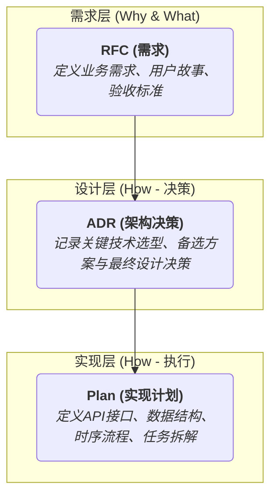

# 1. 目录概述 (Overview)

本目录 (`/rfc`) 是 `Matrix` 项目的**需求提案 (Request for Comments)** 文档库。它用于记录所有新功能、重大变更或架构调整的初始需求、动机和高层设计思路。

RFC流程是进行重大功能设计、核心API变更或架构调整的主要方式。它旨在：
-   在早期阶段就变更的动机、设计和影响达成共识。
-   为架构决策提供一个公开、可追溯的记录。

一份RFC是所有后续设计（ADR）和实现（Plan）的起点。

所有新的RFC都应使用 **[Matrix RFC模板][Tpl-RFCMatrix]** 进行编写。

### 文档索引 (Document Index)

*   [`0001_data-contract-specification_rfc.md`](./0001_data-contract-specification_rfc.md): 定义核心数据契约 `CoreObj` 的规范。
*   [`0002_mcp_asset_search_tool.md`](./0002_mcp_asset_search_tool.md): (标题待规范) 关于MCP资产搜索工具的需求。
*   [`0003_solidify-function-pattern_rfc.md`](./0003_solidify-function-pattern_rfc.md): 固化和完善函数（Function）开发模式。
*   [`0004_http_client_node_enhancement.md`](./0004_http_client_node_enhancement.md): (标题待规范) 增强HTTP客户端节点的功能。
*   [`0005_stateful-aggregator-node_rfc.md`](./0005_stateful-aggregator-node_rfc.md): 设计一个有状态的数据聚合节点。
*   [`0006_ops-foundation-components-and-dsl-extensions_rfc.md`](./0006_ops-foundation-components-and-dsl-extensions_rfc.md): 为运维场景设计基础组件和DSL扩展。
*   [`0007_matrix_cohesion_refactor_rfc.md`](./0007_matrix_cohesion_refactor_rfc.md): 对Matrix进行内聚性重构。
*   [`0008_generic_agent_nodes_rfc.md`](./0008_generic_agent_nodes_rfc.md): 设计一套通用的Agent核心节点。

# 2. 文档命名规范 (NamingConvention)

本目录下的所有文档命名应遵循 **[Architect通用语义化文档规范][Ref-SemanticDoc]** 中定义的文件命名规范。

*   **格式**: `NNNN_<description>_rfc.md`
*   **`NNNN`**: 4位数字，顺序递增，是唯一的**根ID**。例如 `0001`, `0002`。
*   **`<description>`**: 对RFC内容的简短、小写、连字符分隔的描述 (kebab-case)。
*   **`_rfc.md`**: 固定的后缀。

# 3. RFC, ADR, Plan 的关系 (Relation)

RFC, ADR, 和 Plan 共同构成了 `Matrix` 的设计文档体系，三者职责分明，关系如下：

---
<!-- 链接定义区域 -->
[Ref-SemanticDoc]: ../../../../docs/reference/04_semantic_documentation_standard.md
[Tpl-RFCMatrix]: ../../templates/rfc_template.md
