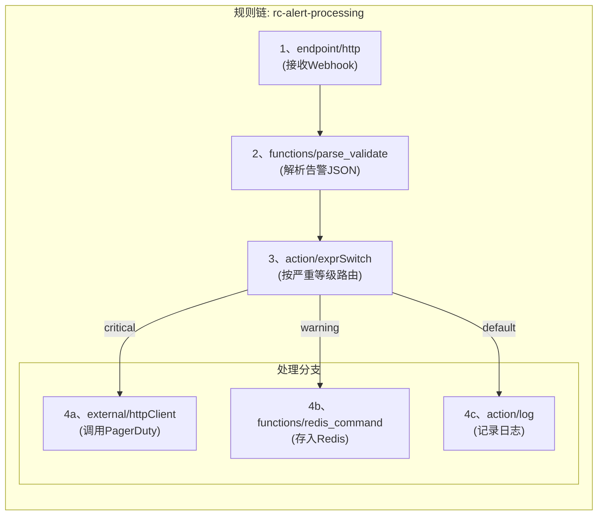

# 1. 场景概述 (ScenarioOverview)

本指南将通过一个完整的端到端示例，展示如何使用 `Matrix` 构建一个 DevOps 告警处理规则链。

**业务场景**:
我们的监控系统（如 Prometheus Alertmanager）会通过 HTTP Webhook 的方式，将告警信息推送到一个统一的接入点。我们需要根据告警的严重等级 (`severity`)，采取不同的处理策略：
*   **严重告警 (`critical`)**: 立即通过 `httpClient` 节点调用外部的 PagerDuty API，触发电话告警。
*   **警告告警 (`warning`)**: 通过 `redis` 节点将告警信息存入 Redis 列表，由另一个系统进行后续的聚合分析和降噪。
*   **其他告警**: 仅通过 `log` 节点记录一条信息级别的日志，不进行任何告警。

# 2. 流程设计 (FlowDesign)

为了实现上述场景，我们将设计一条规则链，其执行流程如下：



# 3. 完整DSL定义 (CompleteDslDefinition)

```json
{
  "ruleChain": {
    "id": "rc-alert-processing",
    "name": "DevOps告警处理规则链",
    "description": "接收来自监控系统的Webhook，根据告警级别进行分发处理",
    "attrs": {
      "executable": true
    }
  },
  "metadata": {
    "nodes": [
      {
        "id": "ep-webhook-receiver",
        "type": "endpoint/http",
        "name": "接收监控系统Webhook",
        "description": "监听POST /api/v1/alert",
        "configuration": {
          "ruleChainId": "rc-alert-processing",
          "startNodeId": "node-parse-alert-body",
          "httpMethod": "POST",
          "httpPath": "/api/v1/alert",
          "endpointDefinition": {
            "request": {
              "bodyFields": [
                {
                  "name": ".",
                  "type": "object",
                  "required": true,
                  "mapping": { "to": "dataT.rawAlert", "defineSid": "map_string_interface" }
                }
              ]
            }
          }
        }
      },
      {
        "id": "node-parse-alert-body",
        "type": "functions/parse_validate",
        "name": "解析并校验告警",
        "description": "将原始告警JSON解析到结构化的DataT对象中",
        "configuration": {
          "source": "dataT.rawAlert",
          "schemaId": "AlertSchema",
          "target": "dataT.parsedAlert"
        }
      },
      {
        "id": "node-route-by-severity",
        "type": "action/exprSwitch",
        "name": "按严重等级路由",
        "description": "根据parsedAlert.labels.severity的值进行路由",
        "configuration": {
          "cases": {
            "Critical": "dataT.parsedAlert.labels.severity == 'critical'",
            "Warning": "dataT.parsedAlert.labels.severity == 'warning'"
          },
          "defaultRelation": "Info"
        }
      },
      {
        "id": "node-call-pagerduty",
        "type": "external/httpClient",
        "name": "调用PagerDuty API",
        "description": "发送紧急告警通知",
        "configuration": {
          "request": {
            "url": "https://events.pagerduty.com/v2/enqueue",
            "method": "POST",
            "headers": {
              "params": [
                { "name": "Content-Type", "mapping": { "from": "'application/json'" } },
                { "name": "Authorization", "mapping": { "from": "'Token token=YOUR_PAGERDUTY_API_KEY'" } }
              ]
            },
            "body": {
              "params": [
                { "name": "routing_key", "mapping": { "from": "'YOUR_PAGERDUTY_ROUTING_KEY'" } },
                { "name": "event_action", "mapping": { "from": "'trigger'" } },
                { "name": "payload.summary", "mapping": { "from": "dataT.parsedAlert.annotations.summary" } },
                { "name": "payload.source", "mapping": { "from": "dataT.parsedAlert.generatorURL" } },
                { "name": "payload.severity", "mapping": { "from": "'critical'" } }
              ]
            }
          },
          "response": {
            "statusCodeTarget": "metadata.pagerdutyStatusCode"
          }
        }
      },
      {
        "id": "node-store-to-redis",
        "type": "functions/redis_command",
        "name": "存入Redis告警池",
        "description": "将警告信息LPUSH到列表中",
        "configuration": {
          "redisDsn": "ref://shared_redis",
          "command": "LPUSH",
          "args": [
            "alert-pool:warning",
            "${data}"
          ]
        }
      },
      {
        "id": "node-log-info-alert",
        "type": "action/log",
        "name": "记录普通告警",
        "description": "记录信息级别的告警日志",
        "configuration": {
          "level": "INFO",
          "message": "Info alert received: ${dataT.parsedAlert.annotations.summary}"
        }
      }
    ],
    "connections": [
      { "fromId": "ep-webhook-receiver", "toId": "node-parse-alert-body", "type": "Success" },
      { "fromId": "node-parse-alert-body", "toId": "node-route-by-severity", "type": "Success" },
      { "fromId": "node-route-by-severity", "toId": "node-call-pagerduty", "type": "Critical" },
      { "fromId": "node-route-by-severity", "toId": "node-store-to-redis", "type": "Warning" },
      { "fromId": "node-route-by-severity", "toId": "node-log-info-alert", "type": "Info" }
    ]
  }
}
```

# 4. 节点详解 (NodeBreakdown)

1.  **`ep-webhook-receiver` (`endpoint/http`)**:
    *   作为规则链的入口，监听 `POST /api/v1/alert` 请求。
    *   它不做任何解析，只是将整个 JSON 请求体完整地放入 `dataT.rawAlert` 对象中。

2.  **`node-parse-alert-body` (`functions/parse_validate`)**:
    *   这是数据标准化的关键步骤。它接收 `dataT.rawAlert`，并根据一个预定义的 `AlertSchema` (假设已在系统中定义) 进行解析和校验。
    *   成功后，会生成一个结构化的 `dataT.parsedAlert` 对象，方便后续节点通过路径 (`.labels.severity`) 安全地访问字段。

3.  **`node-route-by-severity` (`action/exprSwitch`)**:
    *   规则链的决策核心。它检查 `dataT.parsedAlert.labels.severity` 的值。
    *   如果值为 `'critical'`，则将消息路由到 `Critical` 关系。
    *   如果值为 `'warning'`，则路由到 `Warning` 关系。
    *   否则，路由到默认的 `Info` 关系。

4.  **`node-call-pagerduty` (`external/httpClient`)**:
    *   `Critical` 分支的处理节点。
    *   它使用 `inputMappings` 从 `dataT.parsedAlert` 中提取告警摘要、来源等信息，构建一个符合 PagerDuty API 要求的 JSON 请求体，并发送HTTP请求。

5.  **`node-store-to-redis` (`functions/redis_command`)**:
    *   `Warning` 分支的处理节点。
    *   它执行 `LPUSH` 命令，将原始告警（`data` 字段）推入 Redis 的 `alert-pool:warning` 列表中。

6.  **`node-log-info-alert` (`action/log`)**:
    *   `Info` (默认) 分支的处理节点。
    *   它仅从 `dataT.parsedAlert` 中提取告警摘要，并打印一条 `INFO` 级别的日志。

<!-- 链接定义区域 -->
[Guide-MatrixOverview-2b3c4d]: ./00_matrix_guide.md
[Ref-SemanticDoc-d45bce]: ../reference/04_semantic_documentation_standard.md
