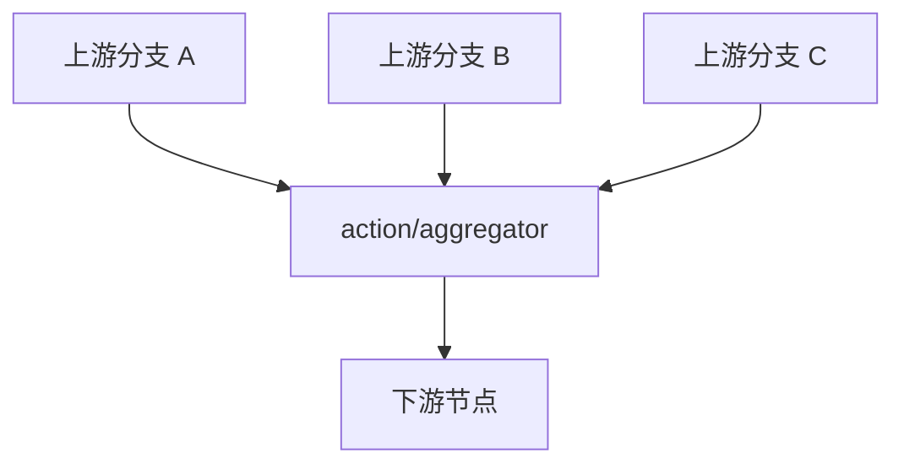

# 1. 功能概述 (Overview)

`action/aggregator` 是 Matrix 当前内建的**并行收敛节点**。它会等待当前节点的所有直接前驱节点都至少成功到达一次，然后才通过 `Success` 关系把消息继续传给下游。

它对应的是 [RFC-0005](../../designs/rfc/0005_stateful-aggregator-node_rfc.md) 中“扇入 / Join”能力的当前落地版本，但要注意：**当前实现是 barrier / join 语义，不是带显式聚合 DSL 的结果合并器。**

## 2. 适用场景 (WhenToUse)

推荐在这些场景里使用：

1. 多个并行探测、抓取或校验分支都结束后，才允许继续。
2. 规则链天然存在固定的上游分支数，且这个分支集合可以直接从拓扑图中推导。
3. 你需要一个“所有前驱都到齐才放行”的同步点，而不想把同步逻辑写进业务函数。

不适合的场景：

1. 动态数量的输入聚合。
2. 需要把多路结果主动合并成一个新对象。
3. 需要基于分支标签、输入名单或 `failFast` 做更复杂的控制。

## 3. 当前配置 (Configuration)

当前实现只有一个可选配置项：

| 配置键 | 类型 | 是否必填 | 含义 | 示例 |
| :--- | :--- | :--- | :--- | :--- |
| `timeout` | `string` | 否 | 使用 Go `time.ParseDuration` 解析的超时时间；如果在此时间内未等到所有前驱，则走 `Failure` | `"5s"`、`"200ms"` |

几个容易误解的点：

1. 当前**没有** `expectedInputs` 配置；需要等待的上游集合是运行时按当前节点的直接前驱自动推导的。
2. 当前**没有** `failFast` 配置。
3. 当前**没有**“输出合并策略”配置。

## 4. 执行语义 (ExecutionSemantics)



当前节点行为可以概括为：

1. 第一次收到消息时，根据运行时拓扑查出所有直接前驱节点。
2. 在 `DataT` 中维护内部状态 `agg_state_<nodeId>`，记录已到达的前驱节点 ID。
3. 每个不同的 `PreviousNodeID` 只会被计数一次。
4. 所有前驱都到齐后，节点通过 `Success` 放行。
5. 如果尚未到齐，节点会发一个内部 `Wait` 关系用于结束当前分支的本次处理；**DSL 中通常不需要配置 `Wait` 出边**。
6. 如果配置了 `timeout` 且超时未收齐，则节点走 `Failure`。
7. 如果当前节点根本没有前驱，它会直接透传消息。

## 5. 输入 / 输出 / 错误 (InputOutputAndFailure)

### 5.1 输入

`action/aggregator` 不要求专门的 `inputs` / `outputs` 契约。它处理的是当前流经它的 `RuleMsg`。

### 5.2 输出

当前实现不会主动构造新的“聚合结果对象”。真正向下游继续传播的，是**最后一个到达并触发收敛成功的那条消息**。

这意味着：

1. 如果多个上游分支各自产生结果，需要在上游就把结果写进可共享的 `DataT` 对象或统一的消息结构中。
2. `action/aggregator` 负责的是“何时放行”，不是“如何合并业务结果”。

### 5.3 错误

当前节点的主要失败路径只有超时：

1. 配置了 `timeout`
2. 在超时之前没有收齐全部直接前驱
3. 节点通过 `Failure` 返回 `aggregator timed out after ...`

## 6. 使用示例 (Example)

```json
{
  "id": "join_probes",
  "type": "action/aggregator",
  "name": "等待所有探测完成",
  "configuration": {
    "timeout": "5s"
  }
}
```

典型连线：

```json
[
  { "fromId": "probe_mysql", "toId": "join_probes", "type": "Success" },
  { "fromId": "probe_redis", "toId": "join_probes", "type": "Success" },
  { "fromId": "probe_zmq", "toId": "join_probes", "type": "Success" },
  { "fromId": "join_probes", "toId": "build_summary", "type": "Success" },
  { "fromId": "join_probes", "toId": "handle_timeout", "type": "Failure" }
]
```

注意：

1. 不需要额外给 `Wait` 配出边。
2. 如果上游分支会分别写入结果，最好事先约定统一的 `DataT` 对象布局，避免最后一条到达的消息缺少其他分支结果。

## 7. 相关现行文档 (RelatedDocs)

1. [RFC-0005：框架级并行任务聚合器节点](../../designs/rfc/0005_stateful-aggregator-node_rfc.md)
2. [学习 Matrix 组件目录](../../reference/21_component_catalog.md)
