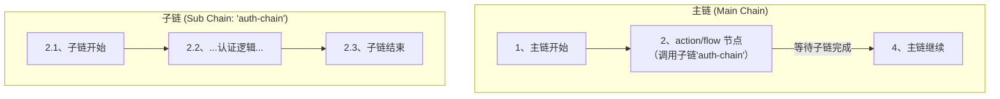

# 1. 功能概述 (FunctionalOverview)

`action/flow` 是一个**子流程调用**节点。它允许将一个完整的、可复用的规则链（称为“子链”）嵌入到另一个规则链（称为“主链”）中。

当消息流经主链到达 `flow` 节点时，主链的执行会**暂停**。节点会**同步地**调用并执行配置中指定的子链，并将当前消息作为子链的输入。直到子链完全执行结束后，主链才会根据子链的最终结果（成功或失败）继续执行。

这个节点是实现逻辑复用、流程抽象和降低规则链复杂度的关键。

# 2. 如何配置 (Configuration)

| 配置键 (ID) | 名称 | 描述 | 类型 | 是否必须 | 默认值 |
| :--- | :--- | :--- | :--- | :--- | :--- |
| `chainId` | 子链ID | 要调用的子规则链的ID。 | `string` | 是 | N/A |
| `fromNodeId` | 子链起始节点ID | (可选) 指定子规则链从哪个节点开始执行。**强烈建议总是明确指定一个起始节点**。 | `string` | 否 | `""` |

# 3. 核心概念 (CoreConcepts)

## 3.1. 同步执行 (SynchronousExecution)

`flow` 节点的核心行为是同步调用。这意味着主链会在此节点“等待”子链完成。



## 3.2. 消息传递 (MessagePassing)

消息在主链和子链之间无缝传递：
1.  到达 `flow` 节点时的消息，会成为子链的**初始消息**。
2.  子链在执行过程中可以任意修改此消息（例如，添加、删除 `metadata` 或 `DataT` 对象）。
3.  子链执行结束时的**最终消息**，会成为 `flow` 节点的输出，并继续在主链中流动。

# 4. 配置示例 (Example)

假设我们有一个通用的“用户认证”子链 `auth-chain`，它接收一个包含 `authToken` 的消息，并返回一个包含 `userInfo` 对象的消息。现在，一个“订单处理”主链 `order-chain` 需要在处理订单前先进行认证。

**子链 (`auth-chain`)**:
*   接收消息，从 `metadata.authToken` 读取令牌。
*   调用外部API验证令牌。
*   将获取到的用户信息存入 `dataT.userInfo` 对象。
*   成功则 `TellSuccess`，失败则 `TellFailure`。

**主链 (`order-chain`) 的 `flow` 节点配置**:
```json
{
  "id": "node-authenticate-user",
  "type": "action/flow",
  "name": "调用用户认证子流程",
  "configuration": {
    "chainId": "auth-chain"
  }
}
```
**连接配置**:
```json
[
  { "fromId": "node-authenticate-user", "toId": "node-process-order", "type": "Success" },
  { "fromId": "node-authenticate-user", "toId": "node-handle-auth-failure", "type": "Failure" }
]
```

**流程解析**:
1.  在 `order-chain` 中，当消息到达 `node-authenticate-user` 时，`order-chain` 暂停。
2.  `auth-chain` 被触发，并接收到当前的消息。
3.  `auth-chain` 执行其认证逻辑。
4.  **如果认证成功**：`auth-chain` 结束，其最终消息（现在包含了 `dataT.userInfo`）被返回。`flow` 节点将此消息通过 `Success` 链路发送给 `node-process-order`。
5.  **如果认证失败**：`auth-chain` 结束并返回错误。`flow` 节点将错误和消息通过 `Failure` 链路发送给 `node-handle-auth-failure`。

# 5. 数据契约 (DataContract)

*   **输入**: 任意 `RuleMsg`。此消息将作为子链的输入。
*   **输出**: 子链执行完毕后的最终 `RuleMsg`。子链对消息的所有修改都会反映在 `flow` 节点的输出中。

# 6. 错误处理 (ErrorHandling)

*   **子链未找到**: 如果配置的 `chainId` 在 `RuntimePool` 中不存在，`flow` 节点会立即失败，并将消息路由到 `Failure` 链路。
*   **子链执行失败**: 如果子链在执行过程中任何一个节点走向了 `Failure` 链路，整个子链的执行被视为失败。`flow` 节点会捕获这个失败状态，并将子链的最终消息和错误信息路由到主链的 `Failure` 链路。

<!-- 链接定义区域 -->
[Guide-MatrixOverview-2b3c4d]: ../00_matrix_guide.md
[Ref-SemanticDoc-d45bce]: ../../reference/04_semantic_documentation_standard.md
