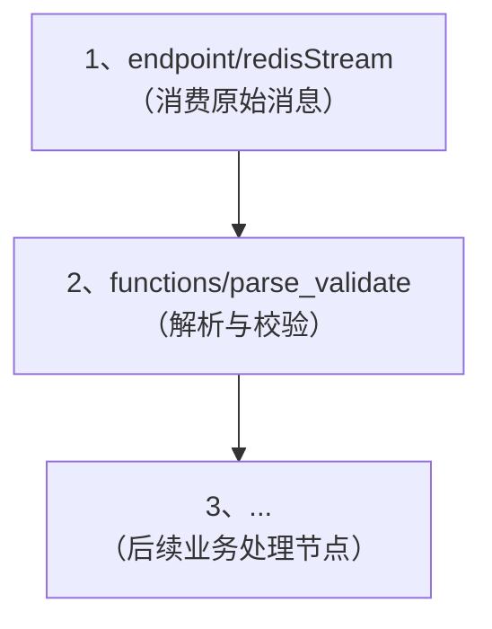

# 1. 功能概述 (FunctionalOverview)

`endpoint/redisStream` 是一个**主动型 (Active)** 的端点节点。它作为一个**消费者组 (Consumer Group)** 的成员，主动连接到 Redis 并持续地从一个 **Redis Stream** 中消费消息。

每当消费到一条新消息，它会自动将消息内容封装成一个 `RuleMsg`，并触发一个指定的规则链。这使得 `Matrix` 可以无缝地集成到基于 Redis Stream 构建的事件驱动架构中，作为流式数据的处理器。

# 2. 如何配置 (Configuration)

| 配置键 (ID) | 名称 | 描述 | 类型 | 是否必须 | 默认值 |
| :--- | :--- | :--- | :--- | :--- | :--- |
| `ruleChainId` | 规则链ID | 当消费到消息时，要触发的规则链的ID。 | `string` | 是 | N/A |
| `startNodeId` | 起始节点ID | (可选) 指定规则链从哪个节点开始执行。**强烈建议总是明确指定一个起始节点**。 | `string` | 否 | `""` |
| `redisDsn` | Redis连接 | 指向共享Redis连接的引用。**必须**使用 `ref://<shared_redis_id>` 格式。 | `string` | 是 | N/A |
| `streamKey` | Stream键名 | 要消费的 Redis Stream 的键名。 | `string` | 是 | N/A |
| `consumerGroup`| 消费者组 | 消费者组的名称。如果不存在，节点会自动在Stream上创建它。 | `string` | 是 | N/A |
| `consumerName` | 消费者名称 | 当前消费者实例在组内的唯一名称。 | `string` | 是 | N/A |
| `batchSize` | 批处理大小 | (可选) 一次拉取操作最多获取的消息数量。 | `int64` | 否 | `1` |
| `blockTimeout`| 阻塞超时 | (可选) 拉取消息时的最长阻塞等待时间。 | `duration` | 否 | `"5s"` |
| `description` | 描述 | 对该端点功能的简短描述。 | `string` | 否 | `""` |

# 3. 配置示例 (Example)

假设我们需要从一个名为 `iot:telemetry` 的 Stream 中消费设备遥测数据，并由 `rc-telemetry-processing` 规则链进行处理。

```json
{
  "id": "ep-redis-stream-consumer",
  "type": "endpoint/redisStream",
  "name": "消费遥测数据流",
  "configuration": {
    "ruleChainId": "rc-telemetry-processing",
    "startNodeId": "node-process-telemetry",
    "redisDsn": "ref://shared_redis_instance",
    "streamKey": "iot:telemetry",
    "consumerGroup": "matrix-processors",
    "consumerName": "processor-instance-01",
    "batchSize": 10,
    "blockTimeout": "10s"
  }
}
```
**流程解析**:
1.  `Matrix` 启动时，该节点会使用ID为 `shared_redis_instance` 的共享Redis连接。
2.  它确保在 `iot:telemetry` 这个Stream上存在一个名为 `matrix-processors` 的消费者组。
3.  节点开始以 `processor-instance-01` 的身份，循环地从 Stream 中拉取最多10条消息，最长阻塞10秒。
4.  每当收到一条消息，它会创建一个 `RuleMsg`，并送往 `rc-telemetry-processing` 规则链的 `node-process-telemetry` 节点开始执行。

# 4. 数据契约 (DataContract)

当一条 Redis Stream 消息被消费时，节点会创建一个新的 `RuleMsg`，其结构如下：

*   **`Data`**:
    *   **类型**: `string`
    *   **内容**: 一个JSON字符串，包含了 Redis Stream 消息中所有的键值对。例如，如果Stream中的消息是 `{"temp": 25.5, "hum": 60}`，那么 `Data` 的内容就是 `'{"temp": 25.5, "hum": 60}'`。
*   **`DataFormat`**:
    *   **值**: `JSON`
*   **`Metadata`**:
    *   `stream`: Stream的键名 (e.g., `"iot:telemetry"`)。
    *   `group`: 消费者组名 (e.g., `"matrix-processors"`)。
    *   `consumer`: 消费者名 (e.g., `"processor-instance-01"`)。
    *   `messageId`: Redis Stream 消息的唯一ID (e.g., `"1678886400000-0"`)。
    *   **上下文传播**: 如果原始消息中包含一个名为 `__matrix_metadata` 的字段，其值是一个JSON字符串化的map，那么这个map中的所有键值对都会被自动提取并添加到 `RuleMsg` 的 `Metadata` 中。这对于跨服务传递链路追踪ID等上下文信息至关重要。

# 5. 典型用法 (TypicalUsage)

`redisStream` 端点的核心职责是作为数据入口，将消息从 Redis 中消费出来。它输出的 `RuleMsg` 的 `Data` 字段是一个原始的 JSON 字符串。

在实际应用中，通常需要将这个 JSON 字符串解析并校验为结构化的 `DataT` 对象，以便后续节点可以方便地访问。因此，**强烈推荐**将 `redisStream` 端点的输出连接到一个 **[functions/parse_validate][Guide-FuncParseValidate]** 节点。



*   **`redisStream` 节点**: 负责从 Redis 拉取消息，将消息体（一个map）序列化为 JSON 字符串，并放入 `RuleMsg.Data`。
*   **`parse_validate` 节点**: 负责接收 `RuleMsg`，读取其 `Data` 字段，根据预定义的 schema (SID) 对 JSON 字符串进行解析和校验，并将结果存入一个结构化的 `DataT` 对象中。

通过这种方式，可以将“数据接入”和“数据解析”这两个关注点完全分离，使规则链更加清晰和模块化。

# 6. 错误处理 (ErrorHandling)

作为一个主动型、长时间运行的端点，`redisStream` 节点主要通过**日志**来报告其在运行过程中遇到的问题，例如：
*   无法获取共享的Redis连接。
*   创建消费者组失败。
*   从 Stream 中拉取消息时发生网络错误。
*   无法启动规则链执行。

# 7. 问答环节 (FrequentlyAskedQuestions)
<!-- qa_section_start -->
> **问：`redisStream` 端点和 `redis_command` 节点有什么区别？**
> **答：** 它们扮演着不同的角色。`redisStream` 端点是一个**消息消费者**，它作为规则链的**起点**，被动地接收来自 Redis Stream 的数据。而 `redis_command` 节点是一个**命令执行器**，它在规则链的**中间环节**，主动地向 Redis 执行各种命令（如 `GET`, `SET`, `HSET`, `XADD` 等）。
<!-- qa_section_end -->

<!-- 链接定义区域 -->
[Guide-MatrixOverview-2b3c4d]: ../00_matrix_guide.md
[Ref-SemanticDoc-d45bce]: ../../reference/04_semantic_documentation_standard.md
[Guide-FuncParseValidate]: ./functions_parse_validate_guide.md
