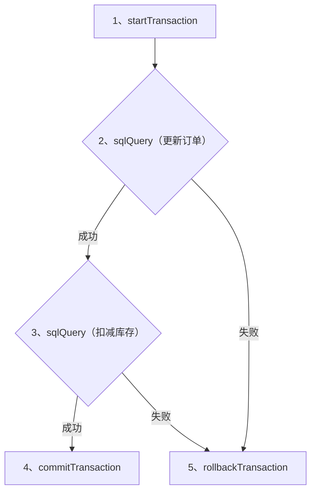

# 1. 功能概述 (Overview)

`Matrix` 提供了一组专门的功能节点来管理数据库事务的生命周期。这组节点通过 `context.Context` 共享事务对象，使得多个 `sqlQuery` 节点可以原子性地执行一系列数据库操作。

这组节点包括：
*   **`startTransaction`**: 开启一个新事务。
*   **`commitTransaction`**: 提交当前事务。
*   **`rollbackTransaction`**: 回滚当前事务。

这种设计将事务控制逻辑从业务逻辑节点中解耦出来，使得规则链的结构更清晰，逻辑更健壮。

# 2. 节点详解 (NodeDetails)

## 2.1. `startTransaction`
<span id="start-transaction"></span>

此节点负责开启一个数据库事务，并将其存储在 `context.Context` 中，以便后续节点使用。

### 配置 (Configuration)

| 配置键 (ID) | 名称 | 描述 | 类型 | 是否必须 | 默认值 |
| :--- | :--- | :--- | :--- | :--- | :--- |
| `dsn` | DSN或引用 | **必须**是一个指向共享DB节点的引用（格式为 `ref://<shared_node_id>`）。不支持临时连接。 | `string` | 是 | N/A |
| `txContextKey` | 事务上下文键 | 用于在 `context` 中存储和检索事务对象的唯一键。 | `string` | 是 | `"tx"` |

## 2.2. `commitTransaction`
<span id="commit-transaction"></span>

此节点用于提交一个由 `startTransaction` 开启的事务。

### 配置 (Configuration)

| 配置键 (ID) | 名称 | 描述 | 类型 | 是否必须 | 默认值 |
| :--- | :--- | :--- | :--- | :--- | :--- |
| `txContextKey` | 事务上下文键 | 必须与 `startTransaction` 节点中配置的键完全一致。 | `string` | 是 | `"tx"` |

## 2.3. `rollbackTransaction`
<span id="rollback-transaction"></span>

此节点用于回滚一个由 `startTransaction` 开启的事务。通常连接在业务处理失败的分支上。

### 配置 (Configuration)

| 配置键 (ID) | 名称 | 描述 | 类型 | 是否必须 | 默认值 |
| :--- | :--- | :--- | :--- | :--- | :--- |
| `txContextKey` | 事务上下文键 | 必须与 `startTransaction` 节点中配置的键完全一致。 | `string` | 是 | `"tx"` |

# 3. 如何使用 (UsagePattern)

事务管理节点的典型使用模式是构建一个有成功和失败分支的规则链。



### 3.1. DSL示例 (DSLExample)

```json
{
  "ruleChain": { ... },
  "metadata": {
    "nodes": [
      {
        "id": "startTx",
        "type": "functions/startTransaction",
        "name": "开启事务",
        "configuration": { "dsn": "ref://my_db", "txContextKey": "user_tx" }
      },
      {
        "id": "updateOrder",
        "type": "functions/sqlQuery",
        "name": "更新订单状态",
        "configuration": {
          "dsn": "ref://my_db",
          "txContextKey": "user_tx",
          "query": "UPDATE orders SET status = 'processing' WHERE id = ?",
          "params": ["${data.orderId}"]
        }
      },
      {
        "id": "commitTx",
        "type": "functions/commitTransaction",
        "name": "提交事务",
        "configuration": { "txContextKey": "user_tx" }
      },
      {
        "id": "rollbackTx",
        "type": "functions/rollbackTransaction",
        "name": "回滚事务",
        "configuration": { "txContextKey": "user_tx" }
      }
    ],
    "connections": [
      { "fromId": "startTx", "toId": "updateOrder", "type": "Success" },
      { "fromId": "updateOrder", "toId": "commitTx", "type": "Success" },
      { "fromId": "updateOrder", "toId": "rollbackTx", "type": "Failure" }
    ]
  }
}
```

# 4. 数据契约 (DataContract)

这组事务管理节点**不会以任何方式修改** `RuleMsg` 的 `Data`、`DataT` 或 `Metadata` 字段。它们只通过 `context.Context` 传递事务状态，对消息本身是透明的。

# 5. 错误处理 (ErrorHandling)

*   **`startTransaction`**:
    *   如果 `dsn` 指向的是一个临时连接而不是共享连接 (`ref://...`)，会失败。
    *   如果数据库无法开启事务，会失败。
*   **`commitTransaction` / `rollbackTransaction`**:
    *   如果在 `context` 中找不到指定 `txContextKey` 对应的事务对象，会失败。
    *   如果数据库提交或回滚操作失败，会失败。

<!-- qa_section_start -->
> **问：为什么 `startTransaction` 强制要求使用共享数据库连接？**
> **答：** 因为事务的生命周期必须跨越多个节点。如果 `startTransaction` 使用一个临时的、用完即关的数据库连接，那么它创建的事务在节点执行完毕后就会随着连接的关闭而失效。后续的 `sqlQuery` 或 `commitTransaction` 节点将无法找到这个事务。只有共享的、长生命周期的数据库连接才能保证事务在整个规则链的执行过程中都保持有效。
<!-- qa_section_end -->

<!-- 链接定义区域 -->
[Guide-MatrixOverview]: ../00_matrix_guide.md
