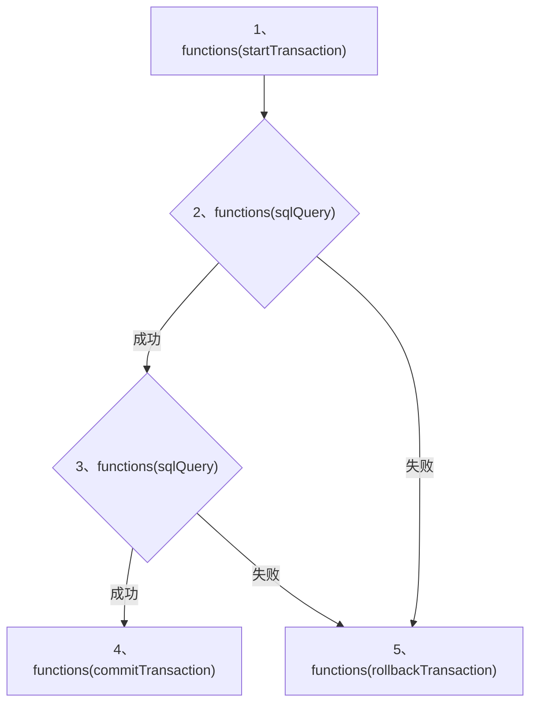

# 1. 功能概述 (Overview)

Matrix 当前并不在 core 中硬编码 `startTransaction`、`commitTransaction`、`rollbackTransaction` 这类节点类型。更推荐的做法是：

1. 由宿主仓库注册事务相关 `functionName`
2. 在 DSL 中统一使用 `type: "functions"`
3. 通过 `configuration.functionName` 选择具体事务动作
4. 通过 shared SQL client 或等价 provider 复用数据库连接

这样事务控制逻辑仍然能和业务 SQL 操作解耦，同时保持函数模型和当前 Matrix 实现一致。

# 2. 推荐模型 (Recommended Model)

典型事务链会包含三类函数：

* **`startTransaction`**: 开启事务，并把事务句柄写入约定上下文
* **`commitTransaction`**: 提交事务
* **`rollbackTransaction`**: 回滚事务

这些 `functionName` 只是示例 ID，是否存在、字段名是什么，取决于宿主仓库自己的函数注册。

## 2.1. 配置建议

建议把配置收敛到 `configuration.business`，而不是散落成一批临时字段：

| 配置键 | 描述 | 示例 |
| :--- | :--- | :--- |
| `sharedDb` | shared SQL client/provider 的引用或名字 | `ref://shared/sql/main` |
| `txContextKey` | 事务句柄在上下文中的唯一键 | `"user_tx"` |
| `query` | 事务内 SQL | `"UPDATE orders SET status = ? WHERE id = ?"` |
| `args` | SQL 参数 | `["processing", "${data.orderId}"]` |

如果项目已经有统一的 `Options` struct 或 `business` schema，优先沿用现有命名。

# 3. 使用方式 (Usage Pattern)


```mermaid
flowchart TD
    startTx["1、functions(startTransaction)"] --> updateOrder{"2、functions(sqlQuery)"};
    updateOrder -- 成功 --> deductStock{"3、functions(sqlQuery)"};
    deductStock -- 成功 --> commitTx["4、functions(commitTransaction)"];
    updateOrder -- 失败 --> rollbackTx["5、functions(rollbackTransaction)"];
    deductStock -- 失败 --> rollbackTx;
```

### 3.1. DSL 示例 (DSL Example)

```json
{
  "ruleChain": { "...": "..." },
  "metadata": {
    "nodes": [
      {
        "id": "startTx",
        "type": "functions",
        "name": "开启事务",
        "configuration": {
          "functionName": "startTransaction",
          "business": {
            "sharedDb": "ref://shared/sql/main",
            "txContextKey": "user_tx"
          }
        }
      },
      {
        "id": "updateOrder",
        "type": "functions",
        "name": "更新订单状态",
        "configuration": {
          "functionName": "sqlQuery",
          "business": {
            "sharedDb": "ref://shared/sql/main",
            "txContextKey": "user_tx",
            "query": "UPDATE orders SET status = ? WHERE id = ?",
            "args": ["processing", "${data.orderId}"]
          }
        }
      },
      {
        "id": "commitTx",
        "type": "functions",
        "name": "提交事务",
        "configuration": {
          "functionName": "commitTransaction",
          "business": {
            "txContextKey": "user_tx"
          }
        }
      },
      {
        "id": "rollbackTx",
        "type": "functions",
        "name": "回滚事务",
        "configuration": {
          "functionName": "rollbackTransaction",
          "business": {
            "txContextKey": "user_tx"
          }
        }
      }
    ],
    "connections": [
      { "fromId": "startTx", "toId": "updateOrder", "type": "Success" },
      { "fromId": "updateOrder", "toId": "commitTx", "type": "Success" },
      { "fromId": "updateOrder", "toId": "rollbackTx", "type": "Failure" }
    ]
  }
}
```

# 4. 设计要点 (Design Notes)

1. 事务生命周期应依赖 shared SQL client 或等价 provider，不要在每个函数节点里临时建连接。
2. 事务句柄的传播建议走上下文或 shared runtime state，而不是把事务对象塞进业务 DataT。
3. `sqlQuery`、`startTransaction`、`commitTransaction`、`rollbackTransaction` 是否存在，取决于宿主仓库的函数注册；Matrix core 只提供通用 `functions` 节点壳。
4. 如果事务函数同时依赖 shared SQL client，优先配合 `matrix-shared-node-creator` 设计 provider/consumer 边界。

# 5. 错误处理 (Error Handling)

常见失败点包括：

* shared DB 引用不存在或 provider 未初始化
* `txContextKey` 不一致，导致提交/回滚节点拿不到事务句柄
* SQL 执行失败
* 事务已经结束却重复提交/回滚

# 6. 相关 Skill (Related Skills)

* `matrix-function-node-creator`
* `matrix-shared-node-creator`
* `matrix-test-author`

<!-- qa_section_start -->
> **问：为什么文档不再使用 `type: "functions/sqlQuery"`？**
> **答：** 因为当前 Matrix core 的通用函数执行器类型是 `functions`，真正决定调用哪个函数的是 `configuration.functionName`。把函数 ID 写进节点类型，会和当前实现脱节。

> **问：事务函数一定是 Matrix core 自带的吗？**
> **答：** 不一定。它们更常见于宿主仓库或业务模块注册的函数集合。本文档描述的是推荐编排模式，不是 core 内建组件清单。
<!-- qa_section_end -->

<!-- 链接定义区域 -->
[Guide-MatrixOverview]: ../00_matrix_guide.md
