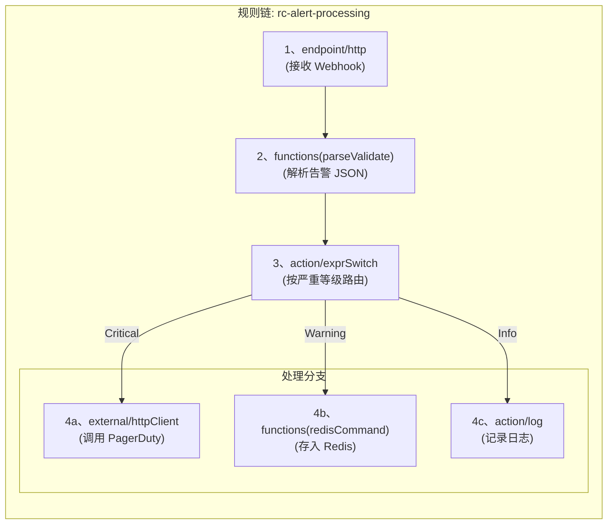

# 1. 场景概述 (Scenario Overview)

本指南通过一个完整示例，展示如何使用 Matrix 构建一条 DevOps 告警处理链。

**业务场景**:
监控系统会通过 HTTP Webhook 推送告警。我们根据 `severity` 做三类处理：

* **`critical`**: 调用 PagerDuty HTTP API
* **`warning`**: 推入 Redis 列表，供后续聚合分析
* **其他告警**: 只记录日志

本文档使用的是 Matrix 当前实现口径：

* HTTP 入参绑定使用 `EndpointIOField` / `EndpointIOPacket`
* 函数节点统一使用 `type: "functions"` + `configuration.functionName`
* `external/httpClient` 使用 `request` / `response` packet 映射

# 2. 流程设计 (Flow Design)



# 3. 完整 DSL 定义 (Complete DSL Definition)

下面的函数名 `parseValidate` 与 `redisCommand` 只是示例，实际以宿主仓库注册的 `functionName` 为准。

```json
{
  "ruleChain": {
    "id": "rc-alert-processing",
    "name": "DevOps 告警处理规则链",
    "description": "接收来自监控系统的 Webhook，根据告警级别进行分发处理",
    "attrs": {
      "executable": true
    }
  },
  "metadata": {
    "nodes": [
      {
        "id": "ep-webhook-receiver",
        "type": "endpoint/http",
        "name": "接收监控系统 Webhook",
        "description": "监听 POST /api/v1/alert",
        "configuration": {
          "ruleChainId": "rc-alert-processing",
          "startNodeId": "node-parse-alert-body",
          "httpMethod": "POST",
          "httpPath": "/api/v1/alert",
          "endpointDefinition": {
            "request": {
              "body": {
                "mapAll": "rulemsg://dataT/rawAlert?sid=MapStringInterface"
              }
            },
            "response": {
              "successCode": 202,
              "body": {
                "fields": [
                  {
                    "name": "accepted",
                    "defaultValue": true,
                    "type": "boolean"
                  }
                ]
              }
            }
          }
        }
      },
      {
        "id": "node-parse-alert-body",
        "type": "functions",
        "name": "解析并校验告警",
        "description": "将原始告警 JSON 解析到结构化对象中",
        "configuration": {
          "functionName": "parseValidate",
          "inputs": [
            {
              "name": "rawAlert",
              "objId": "rawAlert",
              "defineSid": "MapStringInterface"
            }
          ],
          "outputs": [
            {
              "name": "parsedAlert",
              "objId": "parsedAlert",
              "defineSid": "Alert_V1"
            }
          ],
          "business": {
            "schemaId": "AlertSchema"
          }
        }
      },
      {
        "id": "node-route-by-severity",
        "type": "action/exprSwitch",
        "name": "按严重等级路由",
        "description": "根据 parsedAlert.labels.severity 的值进行路由",
        "configuration": {
          "cases": {
            "Critical": "dataT.parsedAlert.labels.severity == 'critical'",
            "Warning": "dataT.parsedAlert.labels.severity == 'warning'"
          },
          "defaultRelation": "Info"
        }
      },
      {
        "id": "node-call-pagerduty",
        "type": "external/httpClient",
        "name": "调用 PagerDuty API",
        "description": "发送紧急告警通知",
        "configuration": {
          "request": {
            "url": "https://events.pagerduty.com/v2/enqueue",
            "method": "POST",
            "headers": {
              "fields": [
                {
                  "name": "Content-Type",
                  "defaultValue": "application/json",
                  "type": "string"
                }
              ]
            },
            "body": {
              "fields": [
                {
                  "name": "routing_key",
                  "defaultValue": "YOUR_PAGERDUTY_ROUTING_KEY",
                  "type": "string"
                },
                {
                  "name": "event_action",
                  "defaultValue": "trigger",
                  "type": "string"
                },
                {
                  "name": "payload.summary",
                  "bindPath": "rulemsg://dataT/parsedAlert.annotations.summary?sid=Alert_V1",
                  "type": "string"
                },
                {
                  "name": "payload.source",
                  "bindPath": "rulemsg://dataT/parsedAlert.generatorURL?sid=Alert_V1",
                  "type": "string"
                },
                {
                  "name": "payload.severity",
                  "defaultValue": "critical",
                  "type": "string"
                }
              ]
            }
          },
          "response": {
            "statusCodeTarget": "pagerdutyStatusCode"
          }
        }
      },
      {
        "id": "node-store-to-redis",
        "type": "functions",
        "name": "存入 Redis 告警池",
        "description": "将警告信息 LPUSH 到列表中",
        "configuration": {
          "functionName": "redisCommand",
          "business": {
            "sharedRedis": "ref://shared/redis/main",
            "command": "LPUSH",
            "args": [
              "alert-pool:warning",
              "${dataT.parsedAlert.annotations.summary}"
            ]
          }
        }
      },
      {
        "id": "node-log-info-alert",
        "type": "action/log",
        "name": "记录普通告警",
        "description": "记录信息级别的告警日志",
        "configuration": {
          "level": "INFO",
          "message": "Info alert received: ${dataT.parsedAlert.annotations.summary}"
        }
      }
    ],
    "connections": [
      { "fromId": "ep-webhook-receiver", "toId": "node-parse-alert-body", "type": "Success" },
      { "fromId": "node-parse-alert-body", "toId": "node-route-by-severity", "type": "Success" },
      { "fromId": "node-route-by-severity", "toId": "node-call-pagerduty", "type": "Critical" },
      { "fromId": "node-route-by-severity", "toId": "node-store-to-redis", "type": "Warning" },
      { "fromId": "node-route-by-severity", "toId": "node-log-info-alert", "type": "Info" }
    ]
  }
}
```

# 4. 节点详解 (Node Breakdown)

1. **`ep-webhook-receiver` (`endpoint/http`)**
   接收 `POST /api/v1/alert`，通过 `body.mapAll` 将整个 JSON 请求体映射到 `dataT.rawAlert`。

2. **`node-parse-alert-body` (`functions` + `functionName=parseValidate`)**
   负责把原始告警对象校验并转换成结构化 `Alert_V1`。

3. **`node-route-by-severity` (`action/exprSwitch`)**
   根据 `dataT.parsedAlert.labels.severity` 路由到 `Critical`、`Warning` 或默认 `Info`。

4. **`node-call-pagerduty` (`external/httpClient`)**
   使用 `request.headers` 与 `request.body.fields` 构造外部请求，并把响应状态码写回 metadata。

5. **`node-store-to-redis` (`functions` + `functionName=redisCommand`)**
   负责把警告告警推入共享 Redis 客户端对应的列表。

6. **`node-log-info-alert` (`action/log`)**
   只记录普通告警日志。

# 5. 设计提醒 (Design Notes)

1. 当前 HTTP 映射统一使用 `EndpointIOPacket`，不要再写 `bodyFields` / `mapping.to`。
2. `parseValidate`、`redisCommand` 这类函数 ID 属于宿主仓库函数注册，不是 Matrix core 内建节点类型。
3. 如果 PagerDuty 请求体或 Redis 参数需要更复杂的对象构造，优先考虑显式字段映射或先用函数节点产出中间对象。
4. 如果这个链路要补自动化验证，优先用 `matrix-test-author` 设计 packet 边界和分支验证。

<!-- 链接定义区域 -->
[Guide-MatrixOverview-2b3c4d]: ./matrix-guide.md
[Ref-SemanticDoc-d45bce]: ./README.md
