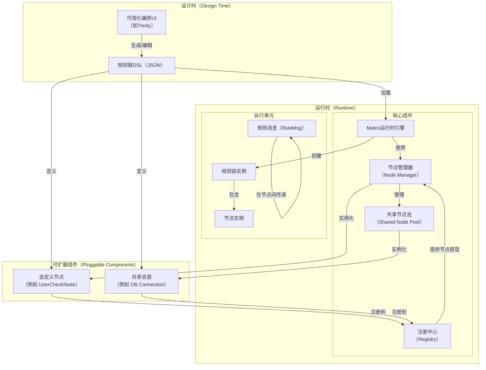

# 学习Matrix框架架构 (ArchitectureOverview)

## 1. 理解Matrix的核心思想 (Overview)

Matrix是一个事件驱动、可插拔的 **业务流程编排框架**，其核心价值在于提供了一种全新的业务开发模式。与传统的MVC等分层架构中深度嵌套的“栈式调用”不同，Matrix倡导一种“链式调用”的开发思想。

在这种模式下，开发者将业务逻辑封装成一个个高内聚、低耦合、功能独立的“节点”（Component）。然后，通过可视化的方式或DSL（领域特定语言），将这些节点连接成“规则链”（Rule Chain），从而完成复杂的业务流程。

这种模式的优势在于：
- **高度解耦**: 每个节点都是独立的，可以独立开发、测试和复用。
- **可观测性强**: 整个业务流程就是一张清晰的图，定义即文档，代码即文档。
- **对AI Agent友好**: AI Agent可以轻松地理解规则链的结构，并能精确地定位到每个节点的具体实现，极大地降低了理解和修改现有业务逻辑的复杂度。

## 2. 学习核心架构 (ArchitectureDiagram)

<!--
finetune_role: "code_explanation"
finetune_instruction: "解释Matrix框架的核心架构图，包括设计时、运行时和可扩展组件三个部分"
-->

## 3. 掌握核心概念 (Core Concepts)

### 3.1. 什么是节点 (Node/Component)？ (WhatIsNode)
节点是Matrix中最基本的执行单元。每个节点都实现`types.Node`接口，并封装了一段特定的业务逻辑。

### 3.2. 什么是规则链 (Rule Chain)？ (WhatIsRuleChain)
规则链是一张有向无环图（DAG），由多个相互连接的节点实例组成。它定义了一条完整的业务处理流程。规则链通常以JSON格式的DSL（领域特定语言）进行定义。

### 3.3. 什么是规则消息 (RuleMsg)？ (WhatIsRuleMsg)
`RuleMsg`是在规则链中流动的数据载体。它采用双重数据模型：
- **`Data()`**: 返回原始的、通常为JSON字符串的负载，用于与外部系统交互。
- **`DataT()`**: 返回一个`DataT`容器，用于在规则链内部传递和操作强类型的、结构化的业务对象。这是Matrix框架进行高效、安全数据处理的核心。
此外，`RuleMsg`还包含用于路由和控制的元数据（Metadata）。

### 3.4. 什么是运行时引擎 (Runtime Engine)？ (WhatIsRuntimeEngine)
引擎负责加载和解析规则链DSL，根据定义创建规则链实例，管理其生命周期，并驱动`RuleMsg`在其中的流转。

### 3.5. 什么是注册中心 (Registry)？ (WhatIsRegistry)
所有节点（包括普通节点和共享资源节点）的“原型”都在此注册。运行时引擎通过注册中心来查找和创建节点实例。这使得框架具有高度的可扩展性。

### 3.6. 什么是共享节点池 (Shared Node Pool)？ (WhatIsSharedNodePool)
为了避免资源浪费，像数据库连接池、HTTP客户端这类可被多个节点复用的资源，会被实例化并存放在共享节点池中。其他节点可以通过引用（`ref://`）的方式来获取和使用这些共享资源。

## 4. 学习常见问题 (FAQ)

<!-- qa_section_start -->
> **问：Matrix的定位是什么？它和传统的MVC框架有什么不同？**
> **答：** Matrix的定位是一个“业务流程编排框架”，它更核心的价值在于引入了一种新的开发模式。传统的MVC框架强调“栈式调用”，业务逻辑通过函数层层嵌套实现。而Matrix倡导“链式调用”，将业务逻辑拆分成独立的、可复用的节点，然后通过规则链将它们“编排”起来。这种模式使得业务流程本身变得非常直观和可观测，并且极大地提升了代码的模块化程度和AI Agent的可维护性。

> **问：规则链是动态加载的还是静态编译的？**
> **答：** 规则链是动态加载的。运行时引擎可以实时地加载和解析JSON格式的规则链DSL，这意味着你可以在不重启服务的情况下，动态地更新、部署和切换业务逻辑。

> **问：既然Matrix可以可视化编排，它和市面上的低代码/无代码平台有什么区别？**
> **答：** 这是一个根本性的区别。传统的低代码平台通常拥有一个**中心化的、重量级的执行引擎**，该引擎通过调用外部的业务接口（如HTTP、gRPC）来工作。而Matrix提供的是一个**轻量化的、可嵌入的业务逻辑编排引擎**。它的核心差异在于：
> 1.  **去中心化与宿主无关**：Matrix引擎本身不绑定任何特定的服务框架。它可以被任何“外壳”包裹——你可以用go-zero或gin框架将它暴露为HTTP接口，用MCP协议提供给AI Agent，或者用消息队列（如Redis Stream）来驱动异步流程。
> 2.  **架构原生适配**：正因为其轻量和可嵌入的特性，Matrix可以无缝地融入任何架构，无论是微服务、单体应用，甚至是Serverless函数。
> 3.  **开发者为中心**：它的目标不是取代代码，而是优化代码的组织方式。开发者依然完全掌控着底层逻辑（节点实现）和外层服务“外壳”。
> 4.  **未来的可扩展性**：这种设计使得未来为它集成配置中心、服务发现、分布式追踪等高级功能变得非常简单。
> 
> 综上，Matrix不是一个试图取代开发者的平台，而是一个赋予开发者更强能力的、灵活的、面向未来的编排**内核**。

> **问：`RuleMsg`中的`Data()`和`DataT()`有什么具体的区别和用途？**
> **答：** `Data()` 和 `DataT()` 体现了Matrix对内外部数据处理的“分层”思想。
> - **`Data()`**: 用于**对外交互**。它返回的是原始的、未经解析的`string`类型数据，通常是JSON格式。当节点需要与外部系统（如HTTP请求的Body、消息队列的消息）交互时，应使用`Data()`来获取或设置原始负载。
> - **`DataT()`**: 用于**对内流转**。它返回的是一个强类型的、结构化的业务对象容器`types.DataT`。在规则链内部，节点之间应优先使用`DataT()`来传递数据。这避免了在每个节点都进行重复的JSON解析和序列化，不仅性能更高，而且由于是强类型，代码也更安全、更易于维护。
> 简单来说，把`Data()`看作是“入口/出口的报文”，把`DataT()`看作是“内部高速公路上的集装箱”。

> **问：Matrix的规则链为什么坚持使用有向无环图（DAG），而不支持有环图来获得更灵活的循环能力？**
> **答：** 这是一个核心的架构决策，旨在保证框架的稳定性、可预测性和可观测性。我们选择通过提供内置的、受控的流程控制节点（如`action/forEach`）来满足循环需求，而不是开放图的拓扑结构。关于此决策的详细论述和风险评估，请参阅相关的架构决策记录（ADR）：
> - **核心参考**: **[ADR-0001: 关于规则链坚持DAG设计的决策记录][ADR-DAGDesign-72fbfe3]**

> **问：这个框架和rulego是什么关系？**
> **答：** **Matrix是一个完全自研的业务流程编排框架，并非基于rulego**。虽然在设计哲学上，`Matrix`可能借鉴了`rulego`等事件驱动和规则引擎项目的一些优秀思想，但在其核心架构、API设计、数据模型（如`DataT`）以及与宿主框架的集成方式上，都是完全独立和不同的。开发者应严格遵循本知识库定义的`Matrix`规范进行开发。
<!-- qa_section_end -->

<!-- 链接定义区域 -->
[ADR-DAGDesign-72fbfe3]: ../designs/adr/0000-1_dag-vs-cyclic-graph_adr.md
