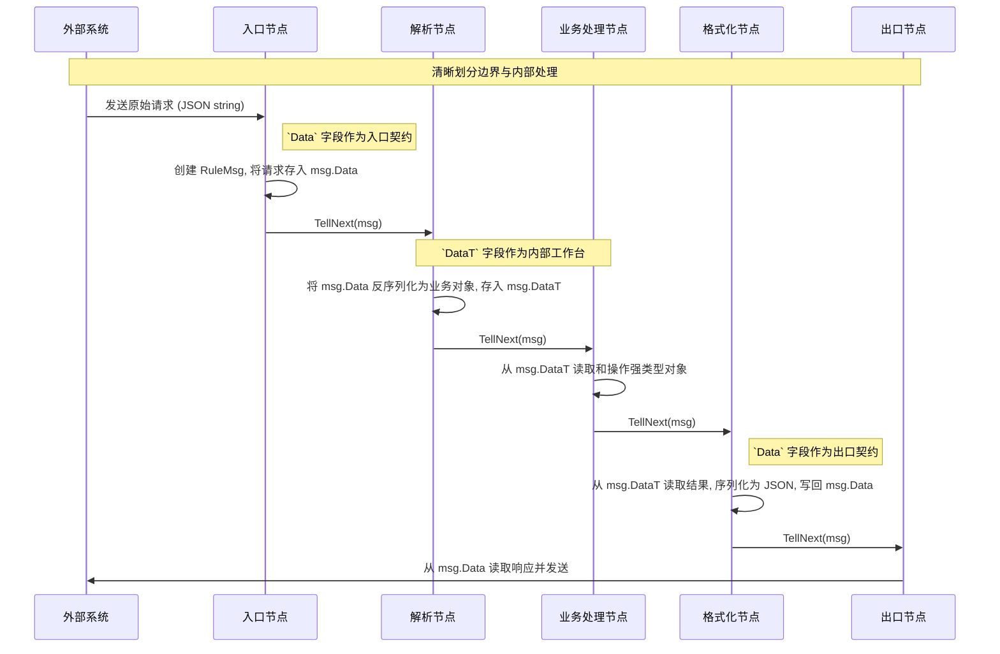

# 1. 核心问题 (TheCoreProblem)

在设计 `Matrix` 引擎的核心数据载体 `RuleMsg` 时，一个关键问题是：**为什么消息体需要同时包含 `Data` 和 `DataT` 两个字段？**

本文档旨在深入探讨这一设计决策背后的思考、权衡以及最终确立的设计模式，这是理解 `Matrix` 数据流处理方式的基石。

# 2. `Data` vs. `DataT`: 职责分离 (SeparationOfConcerns)

`Data` 和 `DataT` 并非功能重叠，而是服务于规则引擎在不同阶段的两种截然不同的需求，它们是一种**互补关系**。

## 2.1. `Data`: 引擎的“序列化边界” (DataAsSerializationBoundary)

*   **定位**: 一个简单的 `string` 类型字段。
*   **核心职责**: 作为 **规则引擎与外部世界沟通的契约**。
*   **场景**:
    1.  **入口**: 当消息从外部系统（如 HTTP API、消息队列）进入引擎时，其原始载荷（通常是 JSON 字符串）被直接存入 `Data` 字段。
    2.  **出口**: 当规则链处理完毕，需要将结果发送到外部系统时，最终的业务对象被序列化为字符串并存入 `Data` 字段。
*   **设计思想**: `Data` 字段确保了 `Matrix` 引擎的输入和输出是简单、通用、可序列化的，从而能轻松地与任何外部系统集成。

## 2.2. `DataT`: 引擎的“内部工作台” (DataTAsInternalWorkbench)

*   **定位**: 一个 `types.DataT` 接口，其实现是一个存储强类型业务对象 (`CoreObj`) 的容器。
*   **核心职责**: 作为 **规则链内部节点之间传递结构化、强类型数据的“工作内存”**。
*   **场景**:
    1.  在规则链的初始阶段，由 `parseValidate` 等解析节点将 `Data` 字段中的字符串反序列化为一个或多个业务对象，并存入 `DataT`。
    2.  在后续的所有业务处理节点中，直接从 `DataT` 中通过Key获取已实例化的Go对象，进行类型安全的、高性能的操作。
*   **设计思想**: `DataT` 字段避免了在每个节点都进行反序列化的开销，保证了引擎内部数据处理的高性能和类型安全。

## 2.3. `Metadata`: 引擎的“控制总线” (MetadataAsControlBus)

*   **定位**: 一个 `map[string]string`。
*   **核心职责**: 携带贯穿整个规则链的**上下文信息或控制指令**，它与核心业务数据分离。
*   **场景**: 传递 `traceId`, `userId`, 路由决策信息等。

# 3. 推荐数据流模式 (RecommendedDataFlow)

# 4. 实践案例：`HttpEndpoint` 的高级数据转换 (CaseStudy)

`HttpEndpoint` 节点是 `RuleMsg` 设计哲学的一个高级应用和演进。它并没有严格遵循上图所示的“先填充`Data`，再解析到`DataT`”的模式，而是进行了优化，**一步到位**地完成了数据转换。

## 4.1. `HttpEndpoint` 的数据流

当一个 `HttpEndpoint` 接收到HTTP请求时，它执行以下数据转换：

1.  **跳过 `msg.Data`**: 节点的Go代码实现**不会**将原始请求体存入 `msg.Data` 字段。`Data` 字段在整个请求处理过程中保持为空。
2.  **声明式解析 -> `msg.DataT`**: 它会直接解析 `endpointDefinition.request` 部分的映射规则，从请求的各个部分（path, query, header, body）提取数据，并根据规则直接构建出 `msg.DataT` 和 `msg.Metadata`。

这个优化的流程避免了不必要的中间步骤，使得从HTTP请求到结构化数据的转换更加高效。

## 4.2. 为何这仍然符合设计哲学？

尽管 `HttpEndpoint` 的实现细节有所不同，但它仍然完美地体现了 `Data` 和 `DataT` 的**职责分离**核心思想：

-   **边界定义**: `endpointDefinition` 本身，作为一个声明式的JSON结构，扮演了**新的“序列化边界”**。它精确地定义了外部HTTP世界与内部Matrix世界之间的契约。
-   **内部工作台**: `DataT` 的角色没有改变，它依然是规则链内部进行高性能、类型安全处理的**唯一工作台**。

因此，`HttpEndpoint` 可以被看作是一个集成了“入口”和“解析”功能的高效复合节点，它遵循了 `RuleMsg` 的设计精髓，并为其提供了一个更强大、更声明式的实现。

<!-- qa_section_start -->
> **问：总结一下 `Data`, `DataT`, `Metadata` 的区别？**
> **答：**
> - **`Data`**: 面向**外部**，存储**原始**、**序列化**的字符串数据。
> - **`DataT`**: 面向**内部**，存储**结构化**、**强类型**的业务对象。
> - **`Metadata`**: 面向**全程**，存储**上下文**和**控制**信息。
<!-- qa_section_end -->

<!-- 链接定义区域 -->
[Guide-MatrixOverview]: ../guides/00_matrix_guide.md
