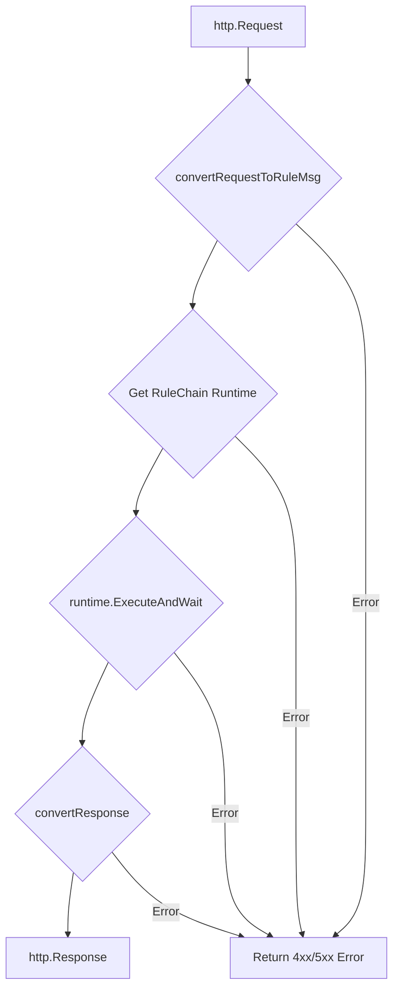

# 参考-10: HttpEndpoint 节点深度解析

本文档基于 `matrix/pkg/components/endpoint/http_endpoint.go` 源码，旨在为高级开发者提供 `HttpEndpoint` 节点内部工作机制的深度剖析。

## 1. 核心职责与定位

`HttpEndpoint` 是一个**被动端点 (PassiveEndpoint)**，其核心职责是充当 **Matrix 引擎与外部 HTTP 世界之间的适配器 (Adapter)**。

它在两个关键阶段发挥作用：
1.  **请求阶段**: 将一个传入的 `http.Request` 对象，转换为一个可供规则链内部处理的 `types.RuleMsg`。
2.  **响应阶段**: 将规则链执行完毕后的最终 `types.RuleMsg`，转换回一个标准的 `http.Response`。

## 2. 核心方法: `HandleHttpRequest`

这是 `HttpEndpoint` 节点作为 HTTP 处理器的主入口。其内部执行流程如下：



## 3. 请求转换详解: `convertRequestToRuleMsg`

这是 `HttpEndpoint` 最复杂、最核心的方法。它完全基于 `endpointDefinition` 的声明式配置，将 HTTP 请求的各个部分解构，并重新组装成一个结构化的 `RuleMsg`。

### 3.1. 数据源准备 (伪代码)

```go
// 1. Prepare data sources
var bodyData map[string]interface{}
json.NewDecoder(r.Body).Decode(&bodyData)

queryParams := r.URL.Query()
headerParams := r.Header
pathParams := extractPathParams(r.Context())
```

### 3.2. 映射处理 (`processMapping`)

函数的核心是一个名为 `processMapping` 的内部闭包，它负责处理每一条 `HttpParam` 映射规则。

**对于每一条规则 (伪代码):**
```go
// 3. Define a generic mapping processor
processMapping := func(param types.HttpParam, ...) error {
    // ...
    // 1. 提取原始值
    rawValue, found := valueProvider(param.Name)
    // 2. 校验 `required`
    // 3. 转换类型 `utils.Convert`
    convertedValue, err := utils.Convert(rawValue, param.Type)
    // 4. 根据 `mapping.to` 写入 `msg.Metadata` 或 `pendingDataT`
    switch msgType {
    case "metadata":
        msg.Metadata()[msgKey] = ...
    case "dataT":
        pendingDataT[objID][fieldPath] = convertedValue
        objDefineSids[objID] = param.Mapping.DefineSID
    }
    return nil
}
```

### 3.3. `DataT` 的构建

在处理完所有映射规则后，函数会遍历 `pendingDataT` 这个临时 map。

**对于其中的每一个 `objId` (伪代码):**
```go
// 5. Build and set DataT objects
dataT := msg.DataT()
for objID, dataMap := range pendingDataT {
    // 1. 获取SID
    defineSid := objDefineSids[objID]
    // 2. 创建空的 CoreObj 实例
    newObj, err := dataT.NewItem(defineSid, objID)
    // 3. 将 map 中的数据填充到 Go struct 中
    utils.Decode(dataMap, newObj.Body())
}
```

> **关键洞察**:
> - `HttpEndpoint` **不使用** `msg.Data` 字段。
> - 整个从 HTTP 请求到 `RuleMsg` 的转换过程是**高度声明式**的，Go 代码本身是通用的，所有业务逻辑都体现在 `endpointDefinition` 的 JSON 配置中。

## 4. 响应转换详解: `convertResponse`

这个函数负责反向操作，将最终的 `RuleMsg` 转换为 HTTP 响应。

**核心逻辑 (伪代码):**
```go
// Process body fields
for _, param := range respDef.BodyFields {
    // 1. 根据 `param.Mapping.To` 路径 (e.g., "dataT.userObj.name") 提取数据
    val, found, _ := helper.ExtractFromMsgByPath(msg, param.Mapping.To)
    if found {
        // 2. 将提取的值设置到响应 map 中
        setValueByDotPath(responseBody, param.Name, val)
    }
}
// 3. 序列化 responseBody 为 JSON 并返回
```

<!-- 链接定义区域 -->
[Ref-MessageDesign]: ./06_message_design_philosophy.md
