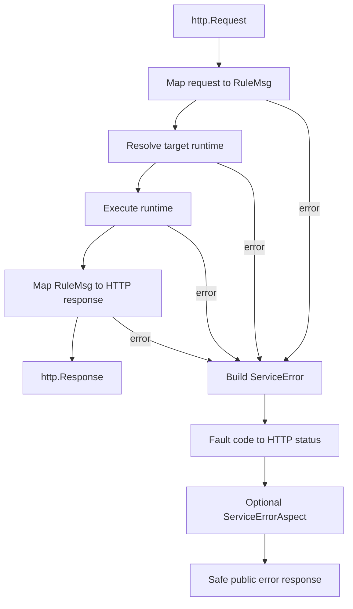

# HttpEndpoint 节点深度解析

本文档基于当前 `internal/builtin/nodes/endpoint/http_endpoint.go` 及相关 helper，实现层面解释 `endpoint/http` 的请求映射和响应映射机制。

## 1. 核心职责

`endpoint/http` 是一个被动入口，它把 HTTP 世界和 `RuleMsg` 世界连接起来：

1. 从 `http.Request` 提取 path/query/header/body
2. 根据 `endpointDefinition.request` 写入 `RuleMsg`
3. 执行目标规则链
4. 根据 `endpointDefinition.response` 从 `RuleMsg` 提取结果，回填 HTTP 响应

## 2. 主流程


```mermaid
flowchart TD
    req["http.Request"] --> mapReq["Map request to RuleMsg"]
    mapReq --> getRt["Resolve target runtime"]
    getRt --> exec["Execute runtime"]
    exec --> mapResp["Map RuleMsg to HTTP response"]
    mapResp --> resp["http.Response"]
    mapReq -- error --> serviceErr["Build ServiceError"]
    getRt -- error --> serviceErr
    exec -- error --> serviceErr
    mapResp -- error --> serviceErr
    serviceErr --> status["Fault code to HTTP status"]
    status --> aspect["Optional ServiceErrorAspect"]
    aspect --> publicResp["Safe public error response"]
```

## 3. 请求侧映射

当前请求映射不再使用旧版 `mapping.to` 闭包，而是统一走 `EndpointIOField` / `EndpointIOPacket` + `helper.ProcessInbound(...)`。

### 3.1. 数据源准备

请求阶段会先准备四类 provider 数据源：

- path params
- query params
- headers
- request body

这些数据源再分别送入 `ProcessInbound(...)`。

### 3.2. `ProcessInbound(...)` 的职责

`ProcessInbound(...)` 会依次处理：

1. `MapAll`
2. `Fields`

对每个 field 来说，核心动作是：

```go
rawVal, found, err := provider.GetValue(field.Name)
convertedVal, err := convertValue(rawVal, field.Type)
err = message.SetInMsg(msg, field.BindPath, convertedVal)
```

也就是说，当前实现的关键字段是：

- `name`
- `type`
- `required`
- `defaultValue`
- `bindPath`

而不是旧文档中的 `mapping.to` / `mapping.defineSid`。

### 3.3. `bindPath` 的意义

`bindPath` 是一条 `rulemsg://...` URI，例如：

- `rulemsg://metadata/deviceId`
- `rulemsg://dataT/telemetry.temp?sid=TelemetryData`

`message.SetInMsg(...)` 会根据 URI 把值写入：

- `Metadata`
- `Data`
- `DataT`

如果目标是 `DataT`，通常需要在 URI 中带上 `sid`，这样运行时才能在对象不存在时自动创建。

## 4. 响应侧映射

响应阶段统一走 `helper.ProcessOutbound(...)`。

流程与请求侧相反：

1. 先处理 `MapAll`
2. 再处理 `Fields`
3. 把结果组装成响应 body / headers

`ProcessOutbound(...)` 的关键行为：

- 如果 `MapAll` 提取到的是对象，会直接 merge 到结果 map
- 如果 `MapAll` 提取到的是标量或数组，且同时定义了 `Fields`，会报错
- `Fields` 中 `bindPath == ""` 时，会优先使用 `defaultValue`

## 5. 错误响应边界

请求映射、runtime 查找、异步启动、同步执行、最终 metadata 失败和响应映射失败，当前都统一经过 `handleError(...)`。该入口执行三件事：

1. 保留 `ServiceError.Cause` 和 `FailureInfo`，供 `ServiceErrorAspect` 以及宿主日志 / Trace 消费。
2. 可选调用宿主注入的 `ServiceErrorAspect`，按 `FailureInfo.Code` 映射安全文案和 status。
3. 调用公开错误呈现层写出 `{code, message, details?}`。

公开 writer 不调用 `ServiceError.Error()`，也不序列化普通 `error.Error()`。未知错误按 HTTP status fail closed，例如 `400` 返回 `invalid request`，`500` 返回 `internal server error`。只有 `ServiceError.UserMessage` 属于显式安全文案；结构化 `details` 仅在错误链显式实现 `PublicErrorDetails() any` 时序列化，普通 cause、字符串 details 或内部 metadata 不会被自动公开。

这条边界保留了内部诊断能力，同时避免将 DataT bind path、SID、原始 URL、存储信息或多层 `cause` 暴露给浏览器。产品级业务 code / 本地化文案仍由模块或 server adapter 负责，Matrix 不硬编码产品身份。

## 6. 为什么现在统一用 `EndpointIOPacket`

统一结构的好处是：

1. `endpoint/http` 和 `external/httpClient` 可以共享一套映射 helper
2. `MapAll + Fields` 模式能覆盖更多协议转换场景
3. 校验器和 OpenAPI 生成器都能复用同一套 schema 模型

## 7. 调试建议

遇到 HTTP 映射异常时，优先检查：

1. `bindPath` 是否是合法 `rulemsg://...` URI
2. 指向 `DataT` 时是否缺失 `sid`
3. `MapAll` 是否和 `Fields` 冲突
4. `type` 是否和实际值兼容
5. 静态契约、DSL 映射和运行时 helper 是否仍使用同一套结构
6. 在 `ServiceErrorAspect` 中检查内部 `FailureInfo`，并按需关联 execution ID 写入受控日志 / Trace；不要依赖浏览器公开 `message` 还原根因

<!-- 链接定义区域 -->
[Ref-MessageDesign]: ./06_message_design_philosophy.md
