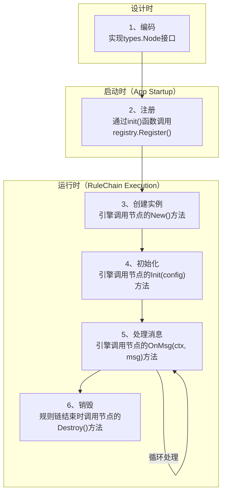

# 参考-12: 通用节点规范

本文档为 `Matrix` 框架中所有**通用组件节点 (Component Node)** 的开发者，提供了权威的技术规范和最佳实践。

## 1. 核心接口与生命周期 (CoreInterfaceAndLifecycle)

一个节点（Node）从注册到销毁的完整生命周期如下图所示。理解生命周期对于正确地开发和使用节点至关重要。



### 1.1. 阶段一：注册 (Registration)

*   **时机**: 应用程序启动时，由Go语言的 `init()` 函数触发。
*   **动作**: 开发者调用 `registry.Default.NodeManager.Register()` 方法，将一个节点的“原型”实例注册到全局管理器中。
*   **目的**: 让框架知道存在这样一种类型的节点，并保留一个原型用于后续创建实例。

### 1.2. 阶段二：创建 (Instantiation)

*   **时机**: 运行时引擎加载一条规则链（Rule Chain）的定义时。
*   **动作**: 引擎从注册中心找到该节点类型的原型，并调用其 `New()` 方法来创建一个新的、干净的节点实例。
*   **核心方法**: `New() Node`
*   **目的**: 为规则链中的每个节点定义创建一个独立的、隔离的实例。

### 1.3. 阶段三：初始化 (Initialization)

*   **时机**: 节点实例被创建之后，处理任何消息之前。
*   **动作**: 引擎调用节点实例的 `Init(configuration Config)` 方法，将该节点在规则链DSL中定义的配置信息传递给它。
*   **核心方法**: `Init(configuration Config) error`
*   **目的**: 使节点实例进入可处理消息的状态。节点在此阶段应解析配置、初始化内部状态、获取共享资源引用等。

### 1.4. 阶段四：处理消息 (Message Processing)

*   **时机**: 当有 `RuleMsg` 流入该节点时。
*   **动作**: 引擎调用节点的 `OnMsg(ctx NodeCtx, msg RuleMsg)` 方法。这是节点执行其核心业务逻辑的地方。此方法可能会被反复调用多次。
*   **核心方法**: `OnMsg(ctx NodeCtx, msg RuleMsg)`
*   **目的**: 执行业务逻辑，处理和传递消息。

### 1.5. 阶段五：销毁 (Destruction)

*   **时机**: 当规则链执行完毕，或者运行时引擎关闭时。
*   **动作**: 引擎调用节点实例的 `Destroy()` 方法。节点在此阶段应释放其占用的所有资源。
*   **核心方法**: `Destroy()`
*   **目的**: 防止资源泄露，确保系统稳定。

## 2. 数据合约规范 (DataContractSpecification)

数据合约的核心思想是：**让节点通过元数据，静态地声明其对消息（`RuleMsg`）中不同数据层的访问模式。** 这使得框架能够进行静态分析、UI智能提示，并保证节点间数据交互的正确性。

### 2.1. 契约声明API (ContractDeclarationAPI)

对于通用组件节点，数据合约直接在其 `NodeDefinition` 结构体中声明。

```go
// in: matrix/pkg/types/node.go

// MetadataDef 描述了对一个元数据键的读或写
type MetadataDef struct {
    Key         string `json:"key"`
    Description string `json:"description"`
}

// NodeDefinition 描述一个节点的静态元数据
type NodeDefinition struct {
    Type        string   `json:"type"`
    Name        string   `json:"name"`
    // ... (其他字段)

    // [数据合约] 声明节点从原始 RuleMsg.Data 中读取的字段路径列表。
    // 例如: ["customer.name", "order.id"]
    ReadsData []string `json:"readsData,omitempty"`

    // [数据合约] 声明节点读取的元数据键。
    ReadsMetadata []MetadataDef `json:"readsMetadata,omitempty"`

    // [数据合约] 声明节点写入的元数据键。
    WritesMetadata []MetadataDef `json:"writesMetadata,omitempty"`
}
```

### 2.2. 与 `function` 节点的区别 (DifferenceFromFunctions)

-   **通用节点**: 如上所示，在 `NodeDefinition` 中声明对 `RuleMsg.Data` 和 `RuleMsg.Metadata` 的访问。它们通常不直接操作类型化的 `DataT` 容器。
-   **`function`**: `function` 是 `DataT` 的主要生产者和消费者。因此，它的**完整数据合约**（包括对 `DataT` 的 `Inputs/Outputs`）被定义在其更具体的 `FuncObject.Configuration` 中。详情请参阅 **[参考-11: 函数开发与注册规范][Ref-FuncSpec]**。

## 3. 共享资源依赖规范 (SharedResourceDependency)

通用节点经常需要与外部的、共享的、昂贵的资源（如数据库连接池、HTTP客户端）进行交互。`Matrix` 提供了一套基于 `SharedNode` 和 `NodePool` 的标准机制来管理这类依赖。

### 3.1. `SharedNode`: 资源提供者

一个节点如果需要提供一个可被共享的资源实例（如 `*sql.DB`），它必须实现 `SharedNode` 接口。最佳实践是嵌入 `base.Shareable[T]` 泛型工具来自动实现。

### 3.2. `ref://`: 资源引用协议

一个节点如果需要消费一个共享资源，它应该在其 `configuration` 中接收一个字符串参数，该参数的值遵循 `ref://` 协议。

**示例 (来自 `sql_query` 节点的DSL配置)**:
```json
{
    "id": "myQueryNode",
    "type": "sql_query",
    "configuration": {
        "dataSource": "ref://local_mysql_client",
        "query": "SELECT * FROM users WHERE id = :userId;"
    }
}
```
这里的 `"dataSource"` 配置项的值 `"ref://local_mysql_client"`，指向了在别处（如 `default_shared_clients.json`）定义的、ID为 `local_mysql_client` 的共享节点。

### 3.3. 连接器辅助函数：最佳实践

消费方的最佳实践是调用一个平台提供的“连接器”辅助函数来获取资源，而不是直接与 `NodePool` 交互。

**实践示例 (在节点的 `Init()` 方法中)**:
```go
func (n *SQLQueryNode) Init(config types.Config) error {
    // ... 从配置中获取 dsn = "ref://local_mysql_client" ...
    dsn, _ := config.GetString("dataSource")

    // 1. 从运行时获取NodePool
    var nodePool types.NodePool
    if rt := n.GetRuntime(); rt != nil { // 假设节点嵌入了BaseNode
        nodePool = rt.GetNodePool()
    }

    // 2. 调用连接器辅助函数
    dbClient, isTemp, err := db.GetDBConnection(nodePool, dsn)
    if err != nil {
        return err
    }
    if isTemp {
        // 通常在 Init 阶段不应创建临时连接，这里应返回错误或警告
        // 并且需要考虑谁来负责关闭这个临时连接
    }
    
    // 3. 将获取到的 dbClient 实例存入节点内部字段
    n.dbClient = dbClient
    return nil
}
```
连接器辅助函数（如 `db.GetDBConnection`）封装了所有复杂性：它会解析 `dsn` 字符串，如果发现是 `ref://` 协议，就从 `nodePool` 中获取共享实例；否则，它可能会创建一个临时的、一次性的连接，并返回 `isTemp=true`，提示调用方必须手动管理其生命周期。

<!-- qa_section_start -->
> **问：数据合约机制是强制性的吗？**
> **答：** 不是强制性的，但**强烈推荐**。所有相关字段都使用了 `omitempty` 标签，这是一个向后兼容的增量增强。未声明契约的旧节点仍然可以工作，但它们将无法从静态分析和未来的工具链增强中受益。

> **问：如果一个节点的契约与它的实际代码实现不一致怎么办？**
> **答：** 这是数据合约的主要风险。在初期，这需要通过严格的代码审查来保证。未来，我们计划开发一个静态分析工具，它可以读取节点的契约，并扫描其代码以验证数据访问是否与声明一致。
<!-- qa_section_end -->

<!-- 链接定义区域 -->
[Ref-FuncSpec]: ./11_function_registration_spec.md
