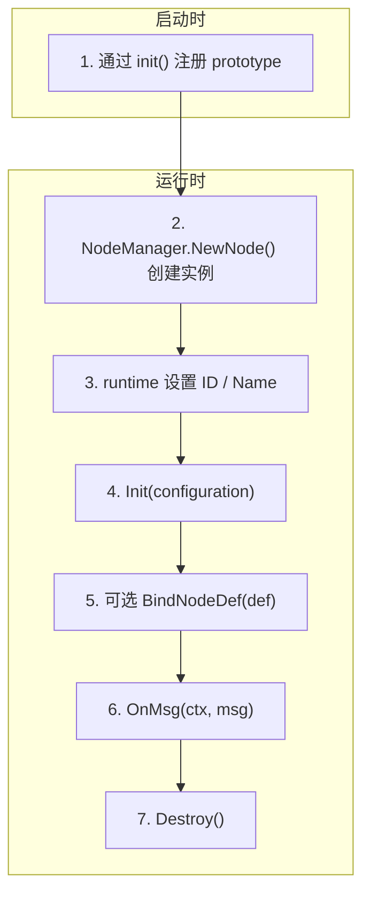

# 参考-12: 通用节点规范

本文档定义 Matrix 通用节点的当前实现规范，重点覆盖生命周期、数据契约和共享资源依赖。本文档以当前代码为准，而不是早期的 `ReadsData` / `ReadsMetadata` 旧字段口径。

## 1. 生命周期 (Lifecycle)

一个节点从注册到销毁的主流程如下：


```mermaid
flowchart TD
    subgraph "启动时"
        register["1. 通过 init() 注册 prototype"]
    end

    subgraph "运行时"
        create["2. NodeManager.NewNode() 创建实例"]
        setMeta["3. runtime 设置 ID / Name"]
        init["4. Init(configuration)"]
        bind["5. 可选 BindNodeDef(def)"]
        onMsg["6. OnMsg(ctx, msg)"]
        destroy["7. Destroy()"]
    end

    register --> create --> setMeta --> init --> bind --> onMsg --> destroy
```

关键点：

1. 节点 prototype 在启动期注册到 `NodeManager`。
2. 规则链加载时，运行时按 `NodeDef.Type` 创建实例。
3. 实例会先被设置 `ID` / `Name`，再收到 `Init(configuration)`。
4. 如果节点实现了 `types.NodeDefBinding`，运行时会在 `Init` 后注入 `NodeDef`，便于读取 `inputs` / `outputs` 等 DSL 绑定信息。

## 2. 数据合约 (DataContract)

当前实现使用统一的读写 URI 契约，而不是旧版的三段式字段。

### 2.1. 静态声明入口

通用节点通过 `NodeMetadata` 声明契约：

```go
type ContractDef struct {
    URI         string `json:"uri"`
    Description string `json:"description"`
}

type NodeMetadata struct {
    Type        string   `json:"type"`
    Name        string   `json:"name"`
    Description string   `json:"description"`
    Dimension   string   `json:"dimension"`
    Tags        []string `json:"tags"`
    Version     string   `json:"version"`
    Icon        string   `json:"icon,omitempty"`

    NodeReads  []ContractDef `json:"nodeReads,omitempty"`
    NodeWrites []ContractDef `json:"nodeWrites,omitempty"`
}
```

对运行时和分析工具暴露的统一视图是：

```go
type DataContract struct {
    Reads  []string
    Writes []string
}
```

嵌入 `types.BaseNode` 的节点通常不需要自己实现 `DataContract()`；`BaseNode` 会自动把 `NodeReads` / `NodeWrites` 展开成 `[]string`。

### 2.2. 常见 URI 约定

当前仓库里最常用的契约 URI 包括：

- `rulemsg://metadata/requestId`
- `rulemsg://data`
- `rulemsg://data/result?format=JSON`
- `rulemsg://dataT/userProfile?sid=UserProfileV1`
- `rulemsg://dataT/userProfile.name?sid=UserProfileV1`

约定说明：

- `metadata`：声明读写消息元数据。
- `data`：声明读写原始消息体。
- `dataT`：声明读写结构化业务对象。
- `sid`：补充 `DataT` 对象类型信息。
- `format`：补充 `msg.Data()` 的序列化格式信息。

### 2.3. 与函数节点的关系

- **通用节点**：通过 `NodeMetadata.NodeReads` / `NodeWrites` 声明静态契约。
- **`functions` 节点**：基础契约来自被调用函数的 `FuncReads` / `FuncWrites`，再由运行时叠加 DSL 中 `inputs` / `outputs` 的对象绑定结果，形成最终契约视图。

## 3. 共享资源依赖 (SharedResourceDependency)

很多通用节点会消费共享资源，例如数据库连接、Redis 客户端、Mongo 客户端或通道管理器。

### 3.1. 提供方：`SharedNode`

如果节点要提供共享实例，它需要实现：

```go
type SharedNode interface {
    Node
    GetInstance() (any, error)
}
```

当前仓库推荐通过嵌入 `internal/builtin/base.Shareable[T]` 来实现这一能力。

### 3.2. 消费方：`ref://` URI

消费共享资源时，建议在配置中接收 URI 字段，例如：

```json
{
  "id": "queryUsers",
  "type": "functions",
  "configuration": {
    "functionName": "sqlQuery",
    "business": {
      "dsn": "ref://local_sql_client",
      "query": "SELECT * FROM users WHERE id = ?"
    }
  }
}
```

这里的 `ref://local_sql_client` 指向一个已预加载进 `NodePool` 的共享节点。

### 3.3. 当前推荐的解析模式

消费方更推荐通过 `pkg/asset` 统一解析资源，而不是在每个节点里直接到处写 `NodePool.GetInstance()`：

```go
resource := asset.Asset[types.SomeClient]{URI: resourceURI}
assetCtx := asset.NewAssetContext(asset.WithNodePool(pool))
client, err := resource.Resolve(assetCtx)
```

这样做的好处：

1. `ref://`、模板值、其他 scheme 都能走统一入口。
2. 解析逻辑可以复用类型校验和错误包装。
3. 业务节点不需要知道 `NodePool` 的底层细节。

`NodePool.GetInstance()` 仍然是可用的底层能力，但更适合封装在 helper / connector 层，而不是散落在每个业务节点实现中。

## 4. 开发建议 (PracticalGuidelines)

1. 新节点默认嵌入 `types.BaseNode` 与 `types.Instance`。
2. `Init()` 只做配置解码、静态校验和轻量初始化；不要在其中执行与消息相关的业务逻辑。
3. 若节点依赖 DSL `inputs` / `outputs`，优先实现 `NodeDefBinding`，不要在 `Init()` 时猜测运行时绑定。
4. 为节点补齐 `NodeReads` / `NodeWrites`，否则静态分析、图谱和校验器会失真。
5. 当节点消费共享资源时，优先收配置 URI，再用 `asset.Asset` / helper 解析。

<!-- qa_section_start -->
> **问：数据合约机制是强制性的吗？**
> **答：** 对编译而言通常不是强制性的，但对静态分析、链路审计、OpenAPI/图谱生成和 DSL 校验非常重要。新节点和持续维护的节点都应尽量补齐。

> **问：如果契约与代码实现不一致怎么办？**
> **答：** 这会导致静态分析和问题排查结果失真。当前最稳妥的做法仍然是代码评审加规则校验，尤其要同步检查 `NodeMetadata`、函数签名和 DSL 绑定是否一致。
<!-- qa_section_end -->

<!-- 链接定义区域 -->
[Ref-FuncSpec]: ./11_function_registration_spec.md
