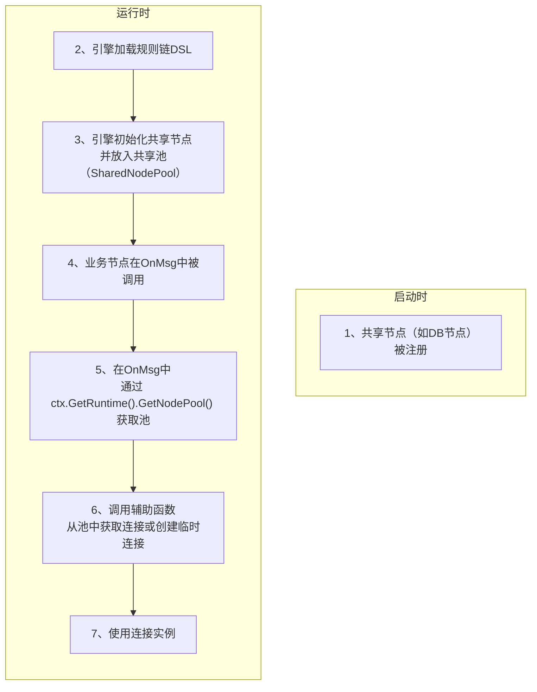

# 如何管理和使用共享资源 (SharedResourceManagement)

本文档解释了Matrix框架中共享资源（Shareable Resource）的管理机制。该机制允许像数据库连接池、HTTP客户端这类昂贵的、可复用的资源被集中管理，并被多个业务节点安全地共享。

## 1. 学习核心概念 (CoreConcept)

共享资源机制由两个核心组件构成：
1.  **`SharedNode` 接口**: 一个节点必须实现此接口，才能成为一个可被共享的资源**提供者**。
2.  **共享节点池 (`NodePool`)**: 一个由运行时管理的全局池，用于存放所有被实例化的`SharedNode`，供业务节点**消费者**按需获取。

**接口定义 (`pkg/types/node.go`):**
<!--
finetune_role: "code_explanation"
finetune_instruction: "解释Matrix框架中用于定义一个共享资源节点的Go语言`SharedNode`接口"
-->
```go
// SharedNode represents a node component that manages a shareable resource.
type SharedNode interface {
	Node
	GetInstance() (any, error)
}
```
*   **`GetInstance() (any, error)`**: 这是`SharedNode`的核心。它返回该节点所管理的资源的**实际业务实例**（例如 `*sql.DB`）。

## 2. 如何实现一个共享节点 (Provider)

实现一个共享资源节点的**标准方式**是通过在其结构体中嵌入 `base.Shareable[T]` 泛型辅助工具。这会自动帮助你的节点实现 `SharedNode` 接口。

以下示例基于 `pkg/components/external/db_client_node.go` 的实现。

<!--
finetune_role: "code_generation_example"
finetune_instruction: "请展示如何通过嵌入base.Shareable来实现一个标准的SharedNode"
-->
```go
package external

import (
    "github.com/jmoiron/sqlx"
    "gitlab.com/neohet/matrix/pkg/components/base"
    "gitlab.com/neohet/matrix/pkg/types"
)

// 1. 定义配置
type DBClientNodeConfiguration struct {
    DriverName string `json:"driverName"`
    DSN        string `json:"dsn"`
}

// 2. 定义节点结构体，并嵌入 base.Shareable[T]
type DBClientNode struct {
    types.BaseNode
    types.Instance
    base.Shareable[*sqlx.DB] // T 是要共享的资源实例类型
    nodeConfig DBClientNodeConfiguration
    client     *sqlx.DB
}

// 3. 在 Init 方法中，初始化嵌入的 Shareable
func (n *DBClientNode) Init(cfg types.Config) error {
    // ... 解析配置到 n.nodeConfig ...

    // 定义一个闭包，封装了创建资源的具体逻辑
    initFunc := func() (*sqlx.DB, error) {
        if n.client != nil {
            return n.client, nil
        }
        db, err := sqlx.Connect(n.nodeConfig.DriverName, n.nodeConfig.DSN)
        if err != nil {
            return nil, err
        }
        n.client = db
        return n.client, nil
    }

    // 使用资源的DSN和初始化函数来初始化Shareable
    return n.Shareable.Init(nil, n.nodeConfig.DSN, initFunc)
}
```

## 3. 如何使用一个共享节点 (Consumer)

消费一个共享资源的**唯一标准模式**是通过 `NodeCtx` 访问运行时（Runtime），进而获取共享节点池（`NodePool`）。

### **工作流程** (Workflow)

<!--
finetune_role: "code_explanation"
finetune_instruction: "解释在Matrix中消费一个共享资源（如数据库连接）的完整工作流程图"
-->


### **实现步骤与示例** (ImplementationExample)

以下示例基于 `redis_command_func.go` 的实现，展示了标准的共享资源消费方法。

<!--
finetune_role: "code_generation_example"
finetune_instruction: "请展示在Matrix中获取和使用共享Redis连接的标准方法"
-->
```go
// (Simplified from redis_command_func.go)
func RedisCommandFunc(ctx types.NodeCtx, msg types.RuleMsg) {
    // ... 从ctx或msg中获取配置，如 redisDsn ...
    redisDsn, _ := bizConfig["redisDsn"].(string)

    // 1. 从运行时上下文(NodeCtx)中获取 NodePool
    var nodePool types.NodePool
    if rt := ctx.GetRuntime(); rt != nil {
        nodePool = rt.GetNodePool()
    }

    // 2. 调用一个自定义的辅助函数来获取连接
    // 这个辅助函数封装了处理 ref:// 和创建临时连接的逻辑
    // 这里的 redis.GetRedisConnection 是一个推荐的实现模式
    client, isTemp, err := redis.GetRedisConnection(nodePool, redisDsn)
    if err != nil {
        ctx.HandleError(msg, err)
        return
    }
    
    // 3. 如果是临时连接，必须使用 defer 手动关闭以防资源泄露
    if isTemp {
        defer client.Close()
    }

    // 4. 使用 client 实例执行业务操作
    err = client.Do(ctx.GetContext(), "GET", "mykey").Err()
    if err != nil {
        ctx.HandleError(msg, err)
        return
    }
    
    ctx.TellSuccess(msg)
}
```

## 4. 学习常见问题 (FAQ)

<!-- qa_section_start -->
> **问：为什么推荐编写一个辅助函数（如`redis.GetRedisConnection`）来处理连接获取？**
> **答：** 因为这个辅助函数可以封装标准逻辑：首先检查资源路径是否为`ref://`引用，如果是，则从`NodePool`中安全地获取`SharedNode`实例；如果不是，它可以选择创建一个临时的、一次性的连接。这种模式将连接管理的复杂性从每个业务节点中抽离出来，使业务节点本身更简洁、更专注于业务逻辑。

> **问：在辅助函数中，如何从`NodePool`获取实例？**
> **答：** `NodePool` 接口提供了 `GetInstance(instanceId string)` 方法。你的辅助函数应该调用此方法，然后对返回的`any`类型进行安全的类型断言，转换为具体的资源类型（如`*redis.Client`）。

> **问：`isTemp`标志和`defer client.Close()`为什么如此重要？**
> **答：** 这是为了确保资源的正确释放。从`NodePool`中获取的共享连接，其生命周期由框架管理，你不应该关闭它。但如果你的辅助函数创建了一个临时的、非共享的连接，那么调用方就必须负责在使用完毕后将其关闭。`isTemp`标志就是这个责任的明确信号，配合`defer`可以确保即使函数出错也能正确关闭连接，防止资源泄露。

> **问：`base.Shareable` 工具到底是做什么用的？**
> **答：** 它是一个帮助你**实现** `SharedNode` 的工具。通过在你自己的节点中嵌入它，你的节点就能自动获得 `GetInstance` 方法，从而满足 `SharedNode` 接口的要求。它还内置了懒加载和线程安全等逻辑，极大地简化了资源提供方节点的开发。
<!-- qa_section_end -->
