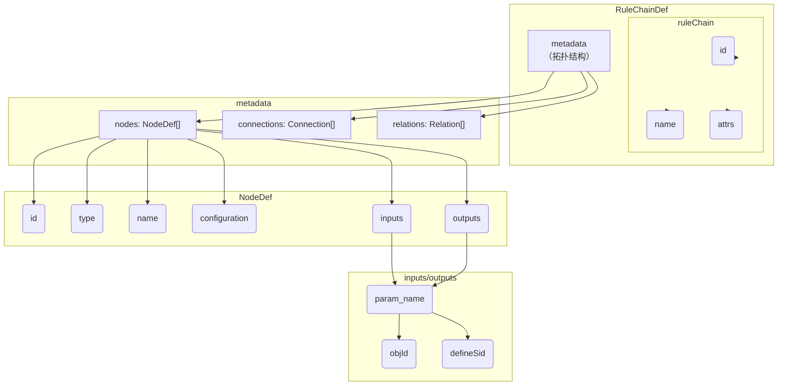

# 1. 理解Matrix DSL：如何定义规则链 (UnderstandingTheDsl)

Matrix DSL (Domain-Specific Language) 是一种基于JSON的、面向用户的语言，用于声明式地定义规则链（Rule Chain）的结构、数据流和行为。它描述了规则链包含哪些节点（Node）、节点的业务配置、节点之间如何传递数据，以及如何与框架的共享资源交互。

本文档是Matrix DSL的官方规范，所有规则链定义都应遵循此结构。

## 1.1. 顶层结构概览 (TopLevelStructure)

一个完整的规则链定义由 `ruleChain`（元数据）和 `metadata`（拓扑结构）两部分组成。

<!--
finetune_role: "code_explanation"
finetune_instruction: "解释Matrix DSL顶层结构的Mermaid流程图"
-->


## 2. 学习核心定义 (LearningCoreDefinitions)

### 2.1. `RuleChainDef`：规则链的根对象 (TheRootObject)

| 字段 | 类型 | 描述 |
| :--- | :--- | :--- |
| `ruleChain` | Object | 包含规则链的全局元数据，如`id`, `name`和`attrs`。 |
| `metadata` | Object | 包含规则链的拓扑结构，即`nodes`（节点列表）、`connections`（执行连接）和`relations`（逻辑关联）。 |

### 2.2. `RuleChain Attrs`：定义规则链属性 (DefiningChainAttributes)

`ruleChain.attrs` 是一个可选对象，用于定义规则链的元属性，特别是用于控制其行为和被外部工具如何理解。

| 字段 | 类型 | 描述 |
| :--- | :--- | :--- |
| `executable` | Boolean | **必需**。`true` 表示这是一个可被Matrix运行时执行的工作流。`false` 表示这仅是一个用于拓扑建模或数据定义的、不可执行的DSL。 |
| `viewType` | String | *(可选)* 为可视化工具提供渲染提示，例如 `static-topology`, `execution-flow`, `hybrid`。 |
| `imports` | []String | *(可选)* 一个字符串数组，包含其他规则链的ID。用于实现配置的复用，详见高级概念部分。 |

### 2.3. `NodeDef`：定义一个节点 (DefiningANode)

`NodeDef` 是DSL的核心，用于定义规则链中的一个处理单元。

| 字段 | 类型 | 描述 |
| :--- | :--- | :--- |
| `id` | String | **必需**。节点的唯一标识符，在规则链内必须唯一。 |
| `type` | String | **必需**。节点的类型，例如 `functions` 或 `action/exprSwitch`。框架根据此类型查找并实例化节点原型。 |
| `name` | String | **必需**。节点的可读名称，用于UI展示和日志。 |
| `configuration` | Object | **必需**。节点的具体配置。通常包含一个`business`子对象，用于存放核心业务逻辑参数。<br/>- **(函数节点专属)** 对于`functions`节点，此对象还可包含`readsData`, `readsMetadata`, `writesMetadata`字段，用于声明其对非`DataT`数据的访问契约。 |
| `inputs` | Object | *(函数节点专属)* 声明`functions`节点消费的`DataT`业务对象。key是函数的逻辑参数名(`pname`)，value是`DataT`中对象的`objId`。 |
| `outputs` | Object | *(函数节点专属)* 声明`functions`节点产生的`DataT`业务对象。key是函数的逻辑参数名(`pname`)，value包含新对象的`objId`和`defineSid`。 |

### 2.4. `Connection`：定义执行连接 (DefiningExecutionConnections)

`Connection` 定义了两个节点之间的**可执行的**有向链接，表示消息的实际流向。`connections` 数组必须构成一个**有向无环图 (DAG)**。

| 字段 | 类型 | 描述 |
| :--- | :--- | :--- |
| `fromId` | String | **必需**。连接的起始节点的`id`。 |
| `toId` | String | **必需**。连接的目标节点的`id`。 |
| `type` | String | **必需**。连接的类型，例如 "Success", "Failure", "Commit"。节点通过`NodeCtx.TellNext(msg, relationType)`将消息发送到具有匹配类型的连接。 |

### 2.5. `Relation`：定义逻辑关联 (DefiningLogicalRelations)

`Relation` 是一个可选的定义，用于描述节点之间的**纯逻辑关系**，主要用于拓扑可视化和静态分析。`relations` 数组**可以构成有环图**。

| 字段 | 类型 | 描述 |
| :--- | :--- | :--- |
| `source` | String | **必需**。关系的起始节点的`id`。 |
| `target` | String | **必需**。关系的目标节点的`id`。 |
| `label` | String | **必需**。描述关系类型的标签，例如 "deployedOn", "connectsTo", "dependsOn"。 |

## 3. 掌握关键概念 (MasteringKeyConcepts)

### 3.1. 数据流：`inputs` 和 `outputs` (DataFlow)

`inputs` 和 `outputs` 是 **`functions`节点专属** 的字段，定义了其与`DataT`业务对象容器的交互契约，是实现结构化数据在函数间传递的关键。非函数节点（如`action`、`filter`等）不使用此机制，它们通过直接访问`RuleMsg`的`Data()`和`Metadata()`来进行简单的数据交互。

*   **`objId` (Object ID)**: 一个字符串，是在`RuleMsg`的`DataT`容器中传递数据时使用的 **运行时Key**。它在整个规则链的生命周期内是动态的。一个节点的`outputs`中声明的`objId`，可以被后续节点的`inputs`引用。
*   **`defineSid` (Definition Semantic ID)**: 一个字符串，引用在`CoreObjRegistry`中注册的 **静态类型定义**。它用于类型校验、文档生成和IDE智能提示。

**示例**:
<!--
finetune_role: "code_generation_example"
finetune_instruction: "提供一个Matrix DSL中inputs/outputs数据流定义的JSON示例"
-->
```json
"inputs": {
  "current_log_id": {
    "objId": "current_log_id_string_ObjId",
    "defineSid": "string"
  }
}
```
这个示例声明了一个名为`current_log_id`的输入参数。在运行时，节点会从`DataT`容器中查找key为`current_log_id_string_ObjId`的数据，并期望其类型与`CoreObjRegistry`中`sid`为`string`的定义相匹配。

### 3.2. 引用共享资源：`ref://` 语法 (SharedResources)

当节点需要访问外部客户端或共享服务（如数据库连接、Redis客户端）时，可以使用`ref://`语法。

### 3.3. 配置复用：`imports` 关键字 (ConfigurationReuse)

`imports` 关键字（位于`ruleChain.attrs`中）是实现“数据与行为分离”和配置复用的核心机制。

*   **工作原理**: 一个可执行的工作流DSL（例如 `workflow_health_check.json`）可以导入一个或多个不可执行的基础拓扑DSL（例如 `base_topology.json`）。在初始化时，Matrix引擎会首先加载所有被导入的拓扑，然后将当前工作流的定义（主要是`connections`）合并到导入的拓扑之上，形成一个最终的、完整的规则链定义。
*   **核心优势**:
    1.  **单一事实来源**: 基础拓扑（如机器、服务及其关系）只需定义一次。
    2.  **数据与行为分离**: 拓扑的“模型”与工作流的“控制器”完全解耦。
    3.  **可维护性**: 当基础拓扑变更时（如IP地址改变），只需修改基础拓扑文件，所有依赖它的工作流都将自动更新。

**示例**:
```json
// In: workflow_health_check.json
{
  "ruleChain": {
    "id": "workflow_health_check",
    "attrs": {
      "executable": true,
      "imports": ["base_topology"]
    }
  },
  "metadata": {
    "nodes": [
      // ... only nodes specific to this workflow
    ],
    "connections": [
      // ... connections that link nodes from this workflow
      // and nodes imported from "base_topology"
    ]
  }
}
```

**示例**:
<!--
finetune_role: "code_generation_example"
finetune_instruction: "提供一个Matrix DSL中通过ref://语法引用共享资源的JSON示例"
-->
```json
"configuration": {
  "business": {
    "dsn": "ref://local_mysql_client"
  }
}
```
在运行时，Matrix框架会解析`ref://`协议，并从`SharedNodePool`中查找ID为`local_mysql_client`的共享资源提供者（Provider），然后将该资源注入到节点中。这实现了配置与资源的解耦。

## 4. 查看一个真实示例 (RealWorldExample)

下面是一个简化版的规则链，用于处理日志、批量操作并更新进度。

<!--
finetune_role: "code_generation_example"
finetune_instruction: "提供一个完整的、用于日志批处理的Matrix DSL规则链JSON示例"
-->
```json
{
  "ruleChain": {
    "id": "LogProcessingBatchFlow",
    "name": "日志批处理流程"
  },
  "metadata": {
    "nodes": [
      {
        "id": "node_add_to_batch",
        "type": "functions",
        "name": "添加到批处理列表",
        "configuration": {
          "functionName": "DataTProcessorFunc",
          "business": {
            "action": "ADD_TO_LIST",
            "listParamName": "batch_list_ObjId",
            "inputParamName": "detail_record_ObjId"
          }
        }
      },
      {
        "id": "node_check_commit_condition",
        "type": "action/exprSwitch",
        "name": "检查批处理提交条件",
        "configuration": {
          "cases": {
            "Commit": "len(dataT.batch_list_ObjId) >= 3"
          },
          "defaultRelation": "Continue"
        }
      },
      {
        "id": "node_commit_batch",
        "type": "functions",
        "name": "批量插入数据库",
        "configuration": {
          "functionName": "CommitBatchFunc",
          "business": {
            "dsn": "ref://local_mysql_client",
            "batchListObjId": "batch_list_ObjId"
          }
        }
      }
    ],
    "connections": [
      { "fromId": "node_add_to_batch", "toId": "node_check_commit_condition", "type": "Success" },
      { "fromId": "node_check_commit_condition", "toId": "node_commit_batch", "type": "Commit" }
    ]
  }
}
```

<!-- qa_section_start -->
> **问：`objId` 和 `defineSid` 有什么本质区别？**
> **答：** `defineSid` 是 **静态类型** 的引用，在框架加载时就已确定，用于定义“是什么”。而 `objId` 是 **动态实例** 的引用，在规则链运行时用于在`DataT`中传递数据，用于定义“用哪个”。一个`defineSid`可以对应多个不同`objId`的实例。

> **问：我必须为每个`input`和`output`都提供`objId`和`defineSid`吗？**
> **答：** **是的，必须如此**。缺少任何一个都可能导致运行时错误或非预期的行为。明确的`objId`和`defineSid`使得数据流清晰、可预测，并且便于工具进行静态分析和验证，是Matrix框架可观测性和健壮性的基石。

> **问：`inputs` 块中的 `defineSid` 有什么用？它又不会创建对象。**
> **答：** 在 `inputs` 块中，`defineSid` 的核心作用是 **类型校验**。Matrix框架在将`DataT`中的数据对象（通过`objId`找到）绑定到节点的输入参数前，会检查该数据对象的实际类型是否与`inputs`中声明的`defineSid`相匹配。这是一种防御性设计，可以提前捕获因上游节点输出变更或DSL配置错误导致的数据类型不匹配问题，避免在业务函数内部出现运行时类型断言失败。

> **问：`ref://` 语法有什么核心优势？**
> **答：** `ref://` 语法的核心优势在于**运行时解耦**。它允许业务逻辑的定义（在规则链DSL中）与基础设施资源的具体实现（在共享节点中）完全分离。这意味着：
> 1.  **环境无关**：同一套业务逻辑DSL，可以在开发环境指向一个本地mock的数据库，在测试环境指向一个测试数据库，在生产环境指向一个高可用的数据库集群，而无需修改任何一行DSL代码，只需要调整共享节点的配置即可。
> 2.  **可维护性**：当需要升级数据库驱动或更换客户端时，你只需要修改那个共享的`DBClientNode`的实现，所有消费它的业务节点都无需改动。
> 3.  **安全性**：敏感信息（如数据库密码）被封装在共享节点的配置中，而不是散落在各个业务节点的DSL里，便于集中管理和加密。
<!-- qa_section_end -->
