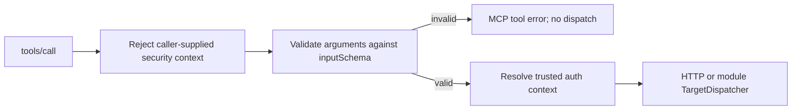

# MCP Endpoint Adapter

Matrix provides a transport-neutral MCP adapter for module-owned business tools. It does not own the transport host process and it does not own business tool catalogs.

## Runtime Shape

Implemented packages:

| Path | Responsibility |
| --- | --- |
| `pkg/types/mcp.go` | Public `McpEndpoint` interface and configuration/result structs. |
| `pkg/mcp` | JSON-RPC MCP protocol handling, `tools/list`, `tools/call`, stdio loop, HTTP handler, endpoint JSON loader, auth context resolution, target dispatch. |
| `internal/builtin/nodes/endpoint/mcp_endpoint.go` | Built-in `endpoint/mcp` node registration for Matrix shared node discovery. |

Transport host ownership:

1. WhiteRoom `cmd/mcp-server` owns stdio and Streamable HTTP process/listener lifecycle.
2. Matrix `pkg/mcp.Server` exposes the handler/stdio loop used by hosts.
3. Business modules own `code/dsl/endpoints/mcp/*.json` catalogs.

## Supported MCP Methods

| Method | Behavior |
| --- | --- |
| `initialize` | Returns MCP capabilities with `tools` enabled and server info. |
| `notifications/initialized` | Accepted as notification. |
| `ping` | Returns an empty result. |
| `tools/list` | Returns only module catalog tools after adapter validation. |
| `tools/call` | Dispatches one whitelisted tool to its configured target. |

## Tool Result Contract

`types.McpToolResult` preserves the MCP result fields independently:

- `content`: ordinary text/image/resource blocks consumed by the model;
- `structuredContent`: optional JSON object for machine-readable output and generic presentation metadata;
- `isError`: optional tool-level failure marker.

The protocol server serializes `structuredContent` at the top level of the `tools/call` result. Matrix does not interpret provider-specific fields and does not replace text content when structured content is present. Module handlers may therefore return a generic contract such as `structuredContent.presentation.sources`, while the consuming Agent Core remains responsible for validation, budgets, persistence and UI projection.

## Target Dispatch

Current target support:

| `target.kind` | Status | Behavior |
| --- | --- | --- |
| `http_api` | Implemented | Calls an existing module HTTP API using configured base URL / method / path. |
| `external_http` | Implemented | Calls an approved external HTTP URL using the same HTTP dispatch path. |
| `rulechain` | Implemented with host binding | Dispatches through the module-supplied `TargetDispatcher`; returns a tool error when the host did not bind one. |
| `handler` | Implemented with host binding | Uses the same `TargetDispatcher` contract for module-local handlers. |

The adapter rejects MVP tools whose `riskLevel` is not `read`.

## Input Schema Boundary

Each non-empty tool `inputSchema` is compiled and validated when the endpoint is
created. An invalid schema prevents endpoint creation.

For every `tools/call`, Matrix validates the JSON-decoded `arguments` against
that compiled schema before resolving auth context or invoking HTTP,
`rulechain`, or `handler` targets. Type mismatches, missing required fields, and
unexpected properties return an MCP tool result with `isError=true`; the target
is not invoked. Matrix does not coerce a number into a declared string merely
because a downstream typed object could accept the converted representation.



## Security Boundary

MCP tool arguments are not trusted identity facts. The adapter rejects argument/schema fields such as:

- `user_id`
- `company_id`
- `permissions`
- `team_ids`
- `session_id`
- `internal_token`
- `authorization`
- `cookie`
- `x_identityx_*`

`dev_static_context` is resolved from host config or env and may inject static headers for local smoke. It does not bypass business module middleware.

## Validation

Focused Matrix tests:

```bash
go test ./pkg/mcp ./internal/builtin/nodes/endpoint
```

`pkg/mcp/protocol_test.go` also verifies that handler-produced `structuredContent` survives HTTP JSON-RPC serialization without dropping the ordinary content blocks.
