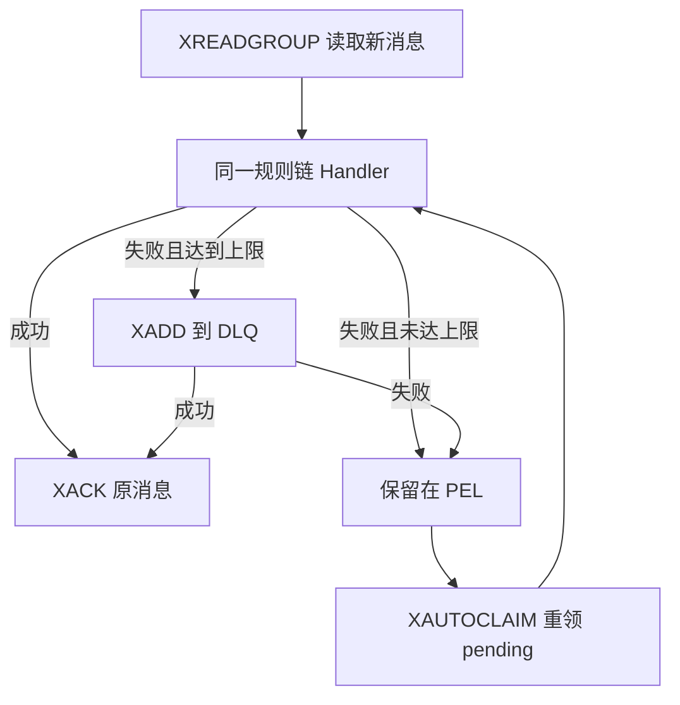

# Redis Stream Endpoint 可靠消费

## 1. 当前定位

`endpoint/redis_stream` 是 Matrix 内建的主动端点。它负责 Redis Stream consumer group 的通用传输语义，并把每次投递交给同一条 Matrix 规则链执行。

Matrix 负责读取、pending 重领、处理超时、ACK、有限投递和 DLQ；业务规则链负责事件结构校验、领域幂等、revision 顺序、业务事务和外部 API 调用。Matrix 不解释任何业务事件类型，也不把某个模块名、角色名或权限名写入通用端点。

## 2. 配置契约

| 字段 | 必填 | 默认值 | 当前语义 |
| --- | --- | --- | --- |
| `enabled` | 否 | 空 | 启用开关表达式。留空表示始终启动。取值为 `true` / `false` 字面量，或解析为布尔值的 `${config:///...}` 模板。见第 2.1 节。 |
| `redisClient` | 是 | 无 | `ref://...` Redis 共享资源。 |
| `stream` | 是 | 无 | 源 Stream。 |
| `group` | 是 | 无 | consumer group。 |
| `consumer` | 否 | 自动生成 | 留空时由节点 ID、主机名、进程 ID 和 worker 序号生成实例唯一名称；固定值只适合单实例或由部署系统注入唯一值。 |
| `ruleChainId` | 是 | 无 | 每次投递触发的规则链。 |
| `startNodeId` | 否 | `""` | 规则链起点。 |
| `count` | 否 | `10` | 单次新消息读取上限。 |
| `blockMs` | 否 | `5000` | `XREADGROUP` 阻塞时间。 |
| `concurrency` | 否 | `1` | worker 数量；每个 worker 使用不同 consumer 名称。 |
| `autoCreateGroup` | 否 | `false` | 是否用 `XGROUP CREATE ... MKSTREAM` 建组。 |
| `groupStartId` | 否 | `0` | 新建 group 的起始 ID。 |
| `ackOnFailure` | 否 | `false` | 旧兼容开关；失败也 ACK。启用 pending recovery 时禁止使用。 |
| `processingTimeoutMs` | 否 | `0`；启用恢复时为 `30000` | 单次规则链处理的 context 超时；规则链节点应响应 context 取消。 |
| `pendingRecovery.enabled` | 否 | `false` | 是否周期性执行 `XAUTOCLAIM`。 |
| `pendingRecovery.minIdleMs` | 否 | 至少 `60000` | 只有空闲超过该阈值的 pending 消息才允许重领，必须大于处理超时。 |
| `pendingRecovery.intervalMs` | 否 | `10000` | 每个 worker 的恢复扫描间隔，首次扫描按 consumer 名称错峰。 |
| `pendingRecovery.count` | 否 | 同 `count` | 单次重领上限。 |
| `pendingRecovery.maxDeliveries` | 否 | `0` | `0` 表示不限制；正数表示达到该投递次数后进入 DLQ。 |
| `pendingRecovery.deadLetterStream` | 条件必填 | 无 | 设置 `maxDeliveries` 时必填。 |

### 2.1 启用开关

`enabled` 决定引擎是否启动这个端点，而不是端点启动后是否处理消息。关闭时端点不解析 Redis 客户端、不建 consumer group、不 claim pending、不产生 DLQ，等价于该定义没有被部署。

判定发生在 `StartActiveEndpoints`，由引擎统一执行；端点节点只在 `Init` 校验表达式格式，不自行解析取值。因此同一份 DSL 可以在不同环境按配置决定是否生效，不需要为"可关闭的端点"单独拆分 Matrix component。

| 写法 | 解析结果 |
| --- | --- |
| 不写 `enabled` | 始终启动，与该字段引入前的行为完全一致。 |
| `"true"` / `"false"` | 直接按字面量判定。 |
| `"${config:///<key>?scope=engine,env&default=false}"` | 按 `config://` 协议解析，见 [Config URI 使用指南](../guides/config-uri-usage-guide.md)。 |

作用域边界与失败行为：

- 只支持 `engine` 和 `env` 两个作用域。判定发生在引擎启动阶段，此时没有 `NodeCtx` 与 `RuleMsg`，`business` 和 `node` 作用域无法解析。引擎会把 `MatrixConfig.Business` 作为 `engine` 作用域喂入，因此 `business:` 配置树里的键仍然读得到。
- `env` 回退沿用既有规则：`a.b.c` 找不到时查 `A_B_C`。
- 表达式解析失败（键不存在且未给 `default`）或解析结果不是布尔值时，`StartActiveEndpoints` 返回错误、引擎启动失败。开关读不出来时不按"启用"处理。
- `Init` 阶段的格式校验比 `strconv.ParseBool` 严格：只接受 `true` / `false` 和 `${...}` 模板，`yes`、`TRUE`、`1` 和带首尾空格的值一律在加载期拒绝。
- 取值只在引擎启动时读取一次，不支持运行时热更新；改开关需要重启进程。

同一套语义适用于所有实现 `types.GatedEndpoint` 的主动端点，当前为 `endpoint/redis_stream` 和 `endpoint/pipeline`。被动端点（如 `endpoint/http`）不走这条链路，也不支持该字段。

## 3. 投递与确认语义

1. 新消息只通过 `XREADGROUP ... >` 读取。
2. pending 消息只通过 `XAUTOCLAIM` 原子重领；多个实例可以使用相同 group，但 consumer 名称必须唯一。
3. 新消息和重领消息调用同一个规则链处理函数，不存在恢复专用业务路径。
4. 规则链成功后才 `XACK`。
5. 规则链失败时默认保留 pending。达到 `maxDeliveries` 后先 `XADD` 到 DLQ，DLQ 写入成功后才 `XACK` 原消息。
6. DLQ 写入或原消息 ACK 失败时返回错误；传输保证是 at-least-once，业务 Handler 和 DLQ 消费者仍须按稳定事件键幂等。

DLQ 会保留原字段，并补充以下 Matrix 元数据：

- `matrix_original_stream`
- `matrix_original_group`
- `matrix_original_consumer`
- `matrix_original_message_id`
- `matrix_delivery_count`
- `matrix_failed_at`
- `matrix_failure`

## 4. 运行流程

## 5. 多实例约束

- 所有实例共享 `stream + group`，让 Redis 在 group 内分配新消息。
- consumer 名称必须按实例和 worker 唯一；推荐将 `consumer` 留空。
- `minIdleMs` 必须大于正常处理的最大时间，防止仍在执行的消息被其他实例重领。
- 恢复扫描以 consumer 名称做首次错峰，并使用游标分批扫描，避免所有实例同时从 PEL 起点高频扫描。
- 实例崩溃后的 pending 消息会在超过 `minIdleMs` 后被存活实例接管；业务端仍必须实现幂等和 revision 防倒退。

## 6. 兼容边界

- 未配置 `enabled` 的既有端点定义行为不变，仍然无条件启动；该字段是 additive 的。
- 未配置 `pendingRecovery` 时，读取和 ACK 行为与旧实现一致，不会自动重领历史 pending。
- `ackOnFailure: true` 只为旧配置保留，会丢弃失败消息；它与 pending recovery 互斥。
- `XAUTOCLAIM` 要求 Redis 6.2 或更高版本。
- context 超时是协作式取消；如果业务节点忽略 context，Matrix 无法强制中止该节点内部的阻塞调用。

## 7. 实现证据

- `internal/builtin/nodes/endpoint/redis_stream_endpoint.go`
- `internal/builtin/nodes/endpoint/redis_stream_endpoint_test.go`
- `internal/builtin/nodes/endpoint/redis_stream_endpoint_enabled_test.go`
- `internal/endpointgate/gate.go`、`internal/endpointgate/gate_test.go`
- `matrix.go` 的 `StartActiveEndpoints`
- `pkg/types/node.go` 的 `GatedEndpoint`
- [Redis Stream Endpoint 使用指南](../guides/components/endpoint_redis_stream_guide.md)
