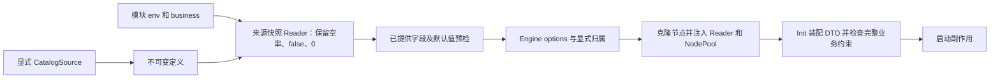

# 模块配置 Reader 与实例注入契约

本文描述配置分支中已实现的 API；Stable 表示契约已核实，不表示已发布远端版本或完成全部业务模块迁移。

## 配置来源与生命周期

`pkg/config/catalog.Load(ctx, source)` 从显式 CatalogSource 编译定义；FSSource 只读取指定文件系统根目录的 `*_catalog.yaml`。不探测父目录、不发现 workspace、不获取部署凭据。

`NewReader(definition, resolver)` 对声明键及 alias 建立一次来源快照。读取顺序沿用 ConfigResolver：普通占位值为 env → business → Catalog default；节点非 Secret 显式覆盖优先。Secret 拒绝节点覆盖，只允许受支持的环境来源，不接受 business/default。Reader 不在读取时重新访问环境，修改环境或 Catalog 必须新建 Reader。

同一次快照中，已经是大写下划线形式的环境键不会因规范化名称相同而再查询一次；首次缺失也是冻结事实。只有规范化名称不同才继续读取兼容名称，再按既有 alias 顺序解析。回归 `TestSnapshotFreezesAbsentCanonicalEnvOnce` 与 `TestSnapshotKeepsDistinctNormalizedEnvName` 覆盖缺失、alias 和点号名称兼容。

来源中明确提供的空字符串与缺失不同。ConfigResolver 对 env、YAML alias、命名来源和转换结果保留空字符串，不继续读取低优先级 alias、business 或 default；required 字符串不能为空，枚举、格式与空白约束仍由 Catalog 声明校验。可选字符串若允许空值，就保留空值；希望采用默认时必须省略该输入。点号环境键仍保留 ConfigAsset 既有的大写下划线名称兼容。此修复仅作用于 ConfigResolver/Catalog，公共 `config://` Asset 的历史空值回退契约不变。

完整执行校验同时覆盖 Schema 中命中的条件 `required`、`dependentRequired` 与 `dependentSchemas`：仅在当前断言分支要求某字符串时拒绝空值，不将可选字段全局设为非空，也不改写 `if/not` 的条件判断。该约束在编译副本中补齐，原始声明和冻结摘要不变。Reader 的单字段预检继续延后根条件，条件完整性必须由 `Catalog.Resolve/Validate` 执行。

| API | 合同 |
| --- | --- |
| `Read[T]` / `ReadNode[T]` | 返回值、是否存在和错误；未知键、类型错误、必填缺失均为错误。ConfigOverride.Present 和来源快照保留 false/0/空字符串的显式语义；空字符串接受 required 及字段 Schema 校验。 |
| `ReadDuration` | 裸整数必须由调用方指定单位；支持 Go 时长，检查乘法溢出，不根据键名猜单位。 |
| `NewDecoder` | 汇总 DTO 装配错误；调用方在网络、文件和业务副作用之前检查 Err。 |
| `Reader.ValidateProvided` | 使用同一快照检查已提供值和默认值；延后缺失必填及根条件约束。 |
| `Catalog.ValidateProvided` | 草稿门禁，允许尚未完成的空字符串输入；该规则不适用于运行来源或 Reader 预检，也不能替代完整执行校验。 |
| `Catalog.Validate` / `Resolve` | 校验完整类型化配置及根条件规则；执行门禁不能由 ValidateProvided 替代。 |
| `Freeze` / `Restore` | 只保存定义，校验格式和摘要；不保存有效值，也不自动升级旧快照。 |

Reader 返回集合副本，格式化和 JSON 输出隐藏值；Issue 使用键、代码和路径，不回显被拒绝的配置原值。int64 通过保留十进制精度的路径处理，拒绝有损浮点整数和溢出。v1 文档的兼容归一化仅发生在 Decode，Restore 不重写冻结内容。

## Engine 与节点边界

宿主在 `matrix.New` 前通过 `WithModuleConfig` 注册 Reader，以 `WithNodeConfigOwners` / `WithRuleChainConfigOwners` 声明归属。配置注入依据显式 module ID，不能从全局环境推导模块身份。

实现 `types.ConfigReaderAware` 的节点在 Init 前收到对应 Reader；实现 NodePoolAware 的节点使用 Engine 自有资源池。启用模块配置的 Engine 中，共享资源加载与注入失败会阻止创建，避免启动半初始化实例。没有启用模块配置的旧 Engine 保留兼容路径。

`FromAssetContext` 依据显式模块选择 Reader；`RenderString` 复用配置占位语法，但 env/engine 拼写不改变 Reader 的来源顺序，其他资产 scheme 和节点局部上下文不由此入口处理。

## 权责与证据

Matrix 拥有解析、类型转换、快照及注入机制；模块拥有 Catalog、DTO 映射和业务条件校验；WhiteRoom 生成装配薄层；Morpheus 在创建 Engine 前调用公开模块 provider。Catalog default 是节点配置默认值的唯一声明源，节点 Schema 不应物化另一套默认值。

实现：`pkg/config/catalog/reader.go`、`reader_validation.go`、`model.go`、`source.go`、`schema.go`、`values.go`，以及 Engine 的 module config options。验证：配置包测试及 `module_config_*_test.go`；操作见 [接入指南](../guides/module-configuration-reader-guide.md)。
